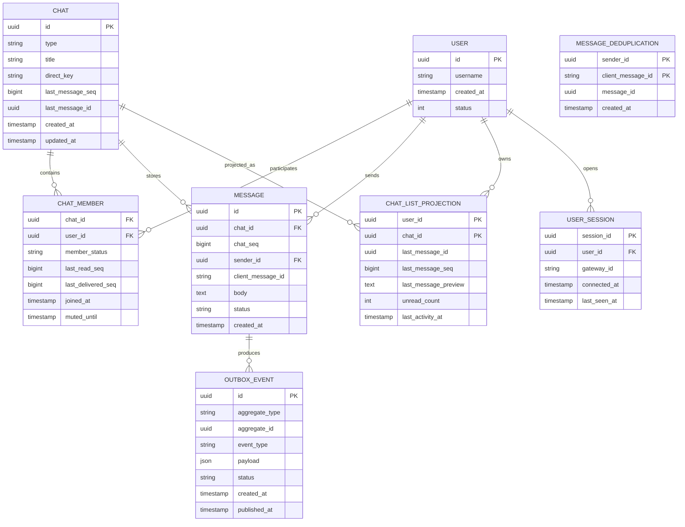
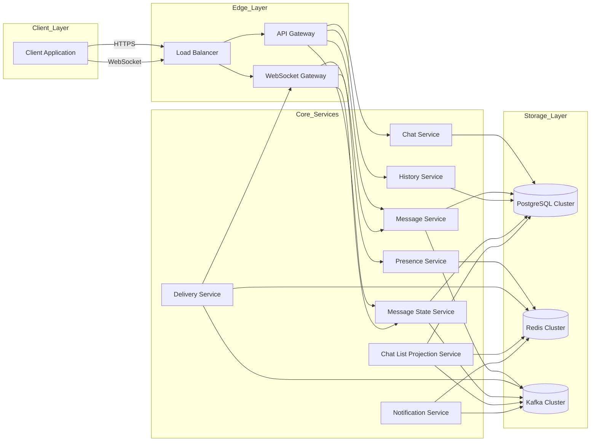
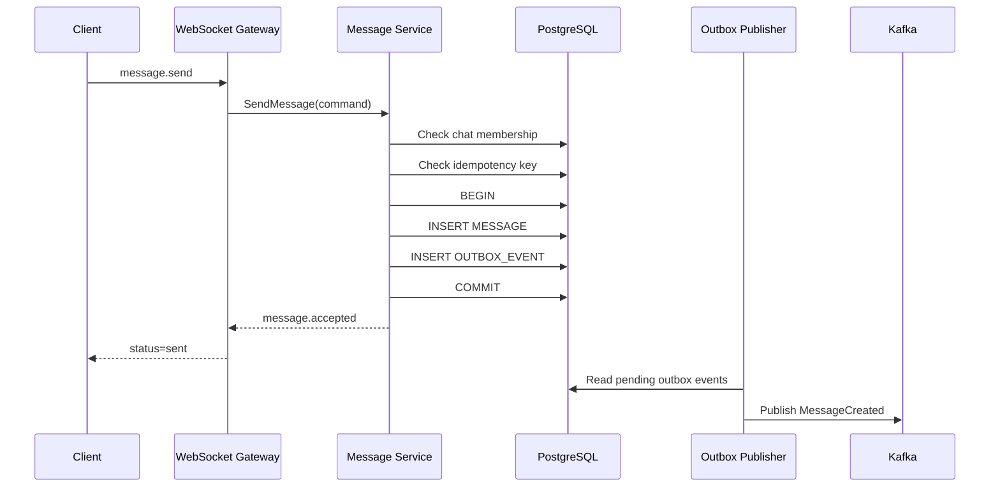
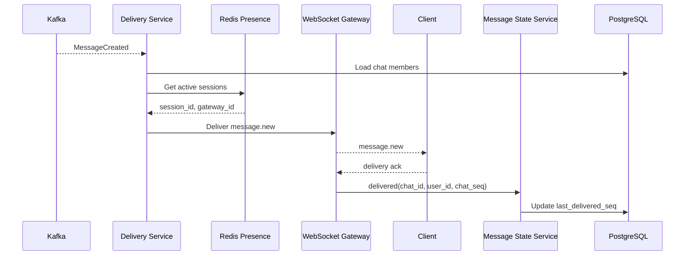
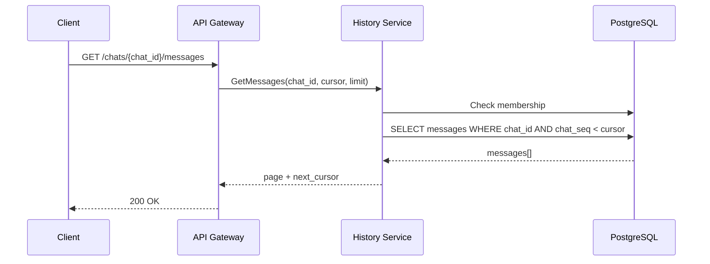
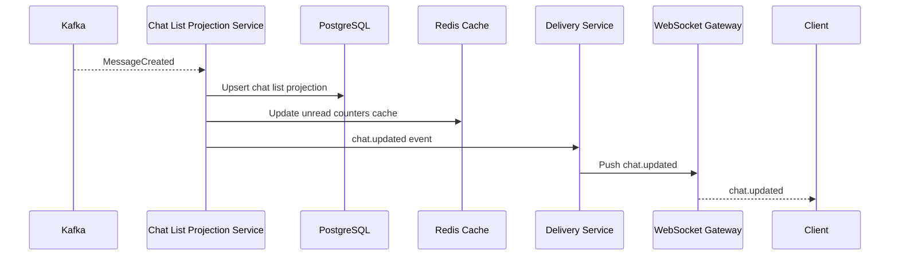
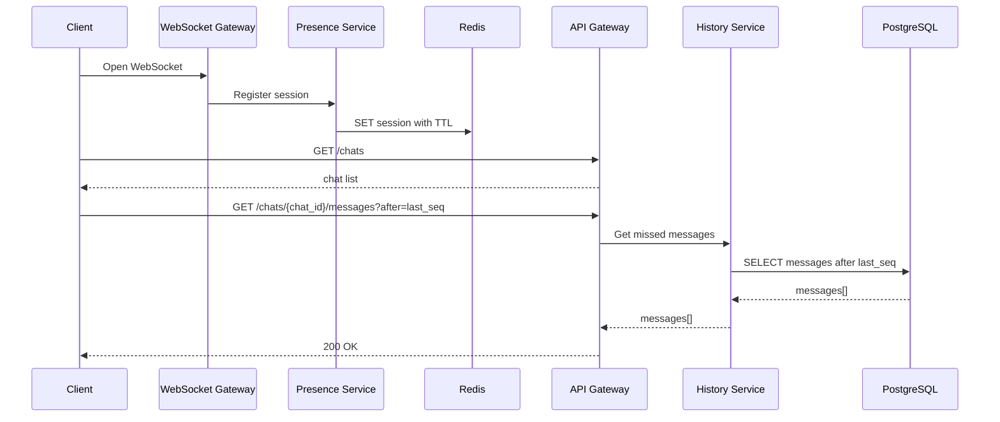
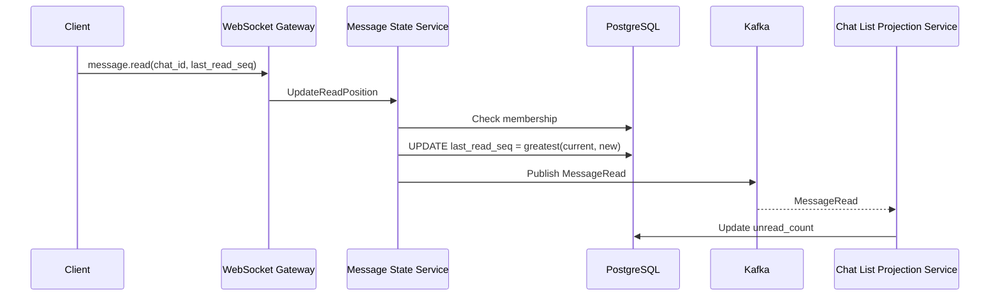
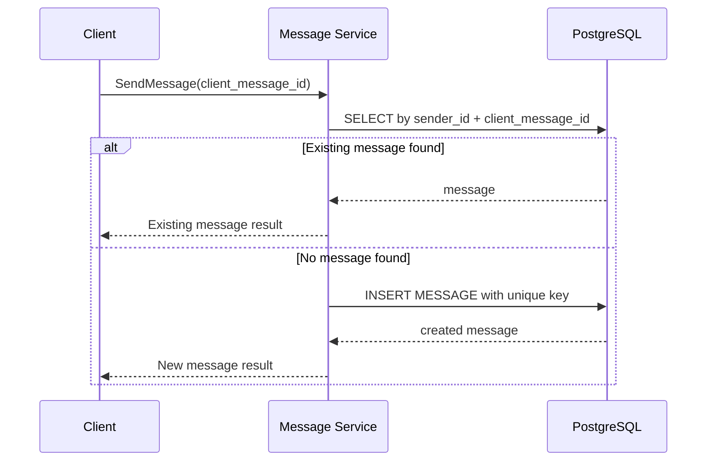

# Техническое решение проекта «Мессенджер»

## Содержание

1. [Введение](#1-введение)  
2. [Постановка задачи и границы системы](#2-постановка-задачи-и-границы-системы)  
3. [Глоссарий](#3-глоссарий)  
4. [Функциональные требования](#4-функциональные-требования)  
5. [Нефункциональные требования](#5-нефункциональные-требования)  
6. [Пользовательские сценарии](#6-пользовательские-сценарии)  
7. [API системы](#7-api-системы)  
8. [Модель данных](#8-модель-данных)  
9. [Архитектура системы](#9-архитектура-системы)  
10. [Технические сценарии](#10-технические-сценарии)  
11. [Порядок, консистентность и идемпотентность](#11-порядок-консистентность-и-идемпотентность)  
12. [Масштабирование и отказоустойчивость](#12-масштабирование-и-отказоустойчивость)  
13. [Наблюдаемость и эксплуатация](#13-наблюдаемость-и-эксплуатация)  
14. [Компромиссы и ограничения архитектуры](#14-компромиссы-и-ограничения-архитектуры)  
15. [Заключение](#15-заключение)  

---

## 1. Введение

Мессенджер относится к классу распределённых интерактивных систем, в которых требуется совмещать высокую скорость обработки пользовательских действий, сохранность данных и устойчивость к частичным сбоям инфраструктуры. Особенность таких систем состоит в одновременном наличии высокой нагрузки на запись, интенсивного чтения истории сообщений и большого числа долгоживущих соединений с клиентскими приложениями.

С технической точки зрения мессенджер объединяет несколько типов задач: приём и фиксацию сообщений, доставку событий активным пользователям, хранение истории переписки, восстановление состояния после повторного подключения, управление онлайн-статусом и обработку повторных запросов. Эти задачи имеют разные требования к задержкам, консистентности и масштабированию, поэтому архитектура системы должна разделять критический контур записи и вторичные контуры доставки, счётчиков, списков чатов и статусов.

Предлагаемое решение описывает архитектуру сервиса обмена текстовыми сообщениями для личных диалогов и групповых чатов. В качестве основных механизмов используются горизонтально масштабируемые сервисы, постоянное хранилище сообщений, брокер событий, кэширование и отдельный контур WebSocket-соединений.

---

## 2. Постановка задачи и границы системы

### 2.1. Назначение системы

Система предназначена для обмена текстовыми сообщениями между пользователями в режиме, близком к реальному времени. Пользователь должен иметь возможность открыть список чатов, просмотреть историю переписки, отправить сообщение и получить новые сообщения от других участников.

### 2.2. Поддерживаемая функциональность

В решении рассматриваются следующие функции:

1. личные диалоги между двумя пользователями;
2. групповые чаты с несколькими участниками;
3. отправка и получение текстовых сообщений;
4. хранение истории переписки;
5. постраничная загрузка сообщений;
6. отображение списка чатов пользователя;
7. отображение последней активности в чате;
8. онлайн-доставка сообщений активным пользователям;
9. доступность сообщений для пользователей, которые были офлайн;
10. статусы сообщений `sent`, `delivered`, `read`;
11. защита от дублей при повторной отправке запроса;
12. базовое отображение онлайн-статуса пользователя.

### 2.3. Границы решения

В состав решения не включаются:

1. голосовые и видеозвонки;
2. отправка файлов и медиа;
3. голосовые сообщения;
4. сквозное шифрование пользовательских сообщений;
5. модерация контента;
6. сложные роли и права администраторов групп;
7. удаление сообщений для всех участников;
8. редактирование сообщений;
9. поиск по содержимому переписки.

Указанные функции могут быть добавлены в развитие архитектуры, однако они требуют отдельных сервисов, моделей данных и механизмов безопасности.

### 2.4. Ключевые архитектурные цели

Архитектура ориентирована на достижение следующих целей:

1. надёжная фиксация каждого принятого сообщения;
2. сохранение порядка сообщений внутри одного чата;
3. доставка сообщений активным пользователям с малой задержкой;
4. возможность получения пропущенных сообщений после повторного подключения;
5. горизонтальное масштабирование контура записи, чтения истории и WebSocket-подключений;
6. устойчивость к сбоям отдельных экземпляров сервисов;
7. предотвращение дублей при повторных клиентских запросах и повторной обработке внутренних событий;
8. разделение синхронных и асинхронных операций.

---

## 3. Глоссарий

| Термин | Определение |
|---|---|
| Пользователь | Учётная запись участника системы, имеющая уникальный идентификатор. |
| Чат | Канал общения между пользователями. В системе поддерживаются личные диалоги и групповые чаты. |
| Личный диалог | Чат с двумя участниками. |
| Групповой чат | Чат с тремя и более участниками. |
| Участник чата | Пользователь, связанный с конкретным чатом через запись членства. |
| Сообщение | Текстовая единица переписки, отправленная пользователем в чат. |
| История сообщений | Упорядоченный набор сообщений внутри чата. |
| Доставка сообщения | Передача сообщения в активную пользовательскую сессию либо обеспечение доступности сообщения после повторного подключения. |
| Статус `sent` | Сообщение принято системой и зафиксировано в постоянном хранилище. |
| Статус `delivered` | Сообщение доставлено активной сессии получателя либо стало доступно участникам чата в истории. |
| Статус `read` | Сообщение прочитано пользователем. |
| Онлайн-статус | Признак наличия активной пользовательской сессии. |
| WebSocket-сессия | Долгоживущее соединение между клиентским приложением и сервером для получения событий в реальном времени. |
| Cursor | Указатель на позицию в истории сообщений для постраничной загрузки. |
| Idempotency key | Уникальный ключ клиентской операции, позволяющий безопасно повторить запрос без создания дубля. |
| Read model | Производное представление данных, оптимизированное для чтения. |
| Fan-out | Рассылка события нескольким получателям. |
| Backpressure | Ограничение темпа обработки для защиты системы от перегрузки. |
| Source of truth | Основное хранилище, содержащее авторитетное состояние данных. |

---

## 4. Функциональные требования

### 4.1. Личные диалоги

Система должна поддерживать создание и открытие личного диалога между двумя пользователями.

Для личного диалога должны храниться:

1. уникальный идентификатор чата;
2. тип чата;
3. идентификаторы двух участников;
4. время создания;
5. идентификатор и время последнего сообщения;
6. состояние чата для каждого участника.

Повторное создание личного диалога между одной и той же парой пользователей должно возвращать существующий диалог.

### 4.2. Групповые чаты

Система должна поддерживать создание групповых чатов и добавление участников.

Для группового чата должны храниться:

1. уникальный идентификатор чата;
2. тип чата;
3. название чата;
4. список участников;
5. время создания;
6. время последней активности;
7. параметры чтения и уведомлений для каждого участника.

Удаление участников и сложная ролевая модель не рассматриваются.

### 4.3. Список чатов пользователя

Система должна предоставлять пользователю список доступных чатов.

Для каждого элемента списка должны отображаться:

1. идентификатор чата;
2. тип чата;
3. название или отображаемое имя собеседника;
4. последнее сообщение или его краткое представление;
5. время последнего сообщения;
6. счётчик непрочитанных сообщений;
7. признак онлайн-статуса собеседника для личного диалога;
8. состояние доставки и чтения последнего исходящего сообщения.

Список чатов сортируется по времени последней активности в порядке убывания.

### 4.4. Отправка сообщений

Система должна позволять пользователю отправлять текстовое сообщение в личный диалог или групповой чат.

При отправке сообщения система должна:

1. проверить членство отправителя в чате;
2. проверить корректность текста сообщения;
3. обработать идемпотентный ключ клиентской операции;
4. зафиксировать сообщение в постоянном хранилище;
5. назначить сообщению порядковый номер внутри чата;
6. вернуть клиенту подтверждение приёма;
7. сформировать событие для последующей доставки участникам чата.

Каждое сообщение должно содержать:

1. `message_id`;
2. `chat_id`;
3. `chat_seq`;
4. `sender_id`;
5. текст сообщения;
6. время создания на сервере;
7. клиентский идентификатор операции;
8. статус обработки.

### 4.5. Получение сообщений

Система должна обеспечивать получение новых сообщений активными пользователями через WebSocket-соединение.

При наличии активной сессии получателя сообщение передаётся в соответствующий WebSocket Gateway. При отсутствии активной сессии сообщение остаётся доступным в истории чата и будет получено пользователем при следующем открытии чата или восстановлении соединения.

### 4.6. История сообщений

Система должна предоставлять постраничную загрузку истории сообщений.

Требования к истории:

1. сообщения выдаются в устойчивом порядке внутри одного чата;
2. пагинация выполняется по cursor, основанному на `chat_seq` или паре `created_at`, `message_id`;
3. при повторном запросе одной страницы не должны появляться пропуски или дубли;
4. чтение старых страниц не должно блокировать запись новых сообщений;
5. пользователь может читать только те чаты, где он является участником.

### 4.7. Статусы сообщений

Система должна поддерживать состояния `sent`, `delivered`, `read`.

Модель статусов задаётся следующим образом:

1. `sent` фиксируется после успешной записи сообщения в основное хранилище;
2. `delivered` для личного диалога фиксируется после передачи сообщения активной сессии получателя либо после подтверждения получения клиентом;
3. `delivered` для группового чата означает, что сообщение зафиксировано и доступно всем участникам чата;
4. `read` фиксируется через обновление позиции чтения пользователя в чате;
5. для групповых чатов чтение хранится как `last_read_seq` по каждому участнику.

Использование позиции чтения снижает объём записей по сравнению с хранением отдельного статуса для каждого сообщения и каждого участника.

### 4.8. Онлайн-статус

Система должна определять наличие активных пользовательских сессий.

Онлайн-статус обновляется через WebSocket-подключение и периодические heartbeat-события. Состояние присутствия хранится в Redis с ограниченным временем жизни. Завершение сессии или истечение TTL переводит пользователя в состояние офлайн.

### 4.9. Работа с офлайн-пользователями

Система должна обеспечивать доступность сообщений для пользователей, которые не были подключены в момент отправки.

Для этого:

1. сообщение сначала фиксируется в постоянном хранилище;
2. доставка через WebSocket выполняется как вторичная операция;
3. при повторном подключении клиент запрашивает историю с последней известной позиции;
4. счётчики непрочитанных сообщений формируются на основе позиции чтения и производных представлений.

### 4.10. Защита от дублей

Система должна предотвращать дублирование сообщений при повторной отправке клиентского запроса, повторной обработке события и сбоях сети.

Для этого используется уникальная пара:

```text
(sender_id, client_message_id)
```

При повторном получении запроса с тем же ключом система возвращает ранее созданное сообщение, не создавая новую запись.

---

## 5. Нефункциональные требования

### 5.1. Нагрузка

Целевые показатели нагрузки:

1. до 50 000 отправок сообщений в секунду в пике;
2. до 200 000 запросов в секунду на чтение истории, получение новых сообщений и обновление списков чатов;
3. большое число одновременно открытых WebSocket-соединений;
4. преобладание коротких операций записи и частых операций чтения;
5. повышенная стоимость доставки одного сообщения в групповые чаты.

### 5.2. Производительность

Целевые показатели задержек:

1. приём сообщения системой — P95 не более 100 мс;
2. доставка онлайн-получателю — в типовом случае не более 1 секунды;
3. получение истории сообщений — P95 не более 150–200 мс;
4. обновление списка чатов — P95 не более 200 мс;
5. обновление позиции чтения — P95 не более 100 мс.

### 5.3. Надёжность

Система должна обеспечивать:

1. отсутствие потери сообщений, принятых системой;
2. корректную обработку повторных клиентских запросов;
3. восстановление доставки после временных сбоев;
4. устойчивость к отказу отдельных экземпляров сервисов;
5. повторную обработку событий без нарушения целостности данных;
6. возможность восстановления производных представлений из основного хранилища и журнала событий.

### 5.4. Консистентность

Для записи сообщения требуется строгая фиксация в основном хранилище. Статус `sent` может быть возвращён только после успешной записи.

Для вторичных данных допускается eventual consistency:

1. счётчики непрочитанных сообщений;
2. список чатов;
3. проекции последнего сообщения;
4. онлайн-статус;
5. агрегированные статусы доставки в групповых чатах.

Порядок сообщений внутри одного чата должен быть определён, устойчив и воспроизводим при чтении истории.

### 5.5. Масштабируемость

Система должна масштабироваться горизонтально по независимым контурам:

1. приём сообщений;
2. запись сообщений;
3. доставка сообщений;
4. хранение истории;
5. чтение истории;
6. WebSocket-подключения;
7. хранение и обновление онлайн-статуса;
8. обновление списков чатов;
9. обработка счётчиков непрочитанных сообщений.

### 5.6. Безопасность

Система должна обеспечивать:

1. аутентификацию пользователя;
2. проверку доступа к каждому чату;
3. запрет чтения чужих сообщений;
4. запрет отправки сообщений в чаты, где пользователь не является участником;
5. ограничение частоты запросов;
6. защиту WebSocket-соединений через токены доступа;
7. хранение служебных идентификаторов без передачи лишних внутренних данных клиенту.

### 5.7. Эксплуатационные требования

Система должна поддерживать:

1. централизованное логирование;
2. сбор метрик по задержкам и ошибкам;
3. трассировку запросов между сервисами;
4. алерты по росту задержек, ошибок и лагов обработки событий;
5. безопасное развёртывание новых версий сервисов;
6. возможность восстановления read-моделей.

---

## 6. Пользовательские сценарии

### 6.1. Просмотр списка чатов

1. Пользователь открывает приложение.
2. Клиентское приложение отправляет запрос на получение списка чатов.
3. Система проверяет аутентификацию пользователя.
4. Chat List Service получает read-модель списка чатов.
5. Система возвращает список чатов, отсортированный по времени последней активности.
6. Клиент отображает последнее сообщение, счётчики непрочитанных сообщений и онлайн-статус.

### 6.2. Открытие личного диалога

1. Пользователь выбирает личный диалог.
2. Клиент запрашивает первую страницу истории сообщений.
3. Система проверяет членство пользователя в чате.
4. History Service возвращает последние сообщения в порядке возрастания `chat_seq`.
5. Клиент отображает историю.
6. Клиент открывает WebSocket-подписку на события выбранного чата.

### 6.3. Создание личного диалога

1. Пользователь выбирает другого пользователя и инициирует личный диалог.
2. Система проверяет наличие существующего диалога между этими пользователями.
3. Если диалог существует, возвращается его `chat_id`.
4. Если диалог отсутствует, создаётся новая запись типа `direct`.
5. Для обоих участников создаются записи членства в чате.

### 6.4. Создание группового чата

1. Пользователь выбирает несколько участников.
2. Клиент отправляет запрос на создание группового чата.
3. Система создаёт запись чата типа `group`.
4. Для каждого выбранного пользователя создаётся запись членства.
5. Создатель получает идентификатор созданного чата.
6. Остальным участникам формируется событие о появлении нового чата.

### 6.5. Отправка сообщения

1. Пользователь вводит текст и нажимает кнопку отправки.
2. Клиент формирует `client_message_id`.
3. Запрос отправляется в Message Service через API Gateway или WebSocket Gateway.
4. Message Service проверяет право отправки в чат.
5. Message Service фиксирует сообщение в базе данных.
6. Система возвращает отправителю сообщение со статусом `sent`.
7. Событие о новом сообщении передаётся в Kafka.
8. Delivery Service доставляет событие активным участникам чата.
9. Read Model Service обновляет список чатов и счётчики непрочитанных сообщений.

### 6.6. Получение сообщения онлайн-пользователем

1. Получатель имеет активное WebSocket-соединение.
2. Presence Service содержит сведения об активной сессии пользователя.
3. Delivery Service определяет WebSocket Gateway, обслуживающий сессию получателя.
4. Сообщение передаётся в WebSocket Gateway.
5. WebSocket Gateway отправляет событие клиентскому приложению.
6. Клиент подтверждает получение.
7. Система обновляет состояние доставки.

### 6.7. Получение сообщений после офлайн-периода

1. Пользователь открывает приложение после периода отсутствия подключения.
2. Клиент устанавливает WebSocket-соединение.
3. Presence Service регистрирует активную сессию.
4. Клиент запрашивает список чатов и историю с последней сохранённой позиции.
5. History Service возвращает сообщения, созданные после указанной позиции.
6. Счётчики непрочитанных сообщений пересчитываются или читаются из read-модели.

### 6.8. Прочтение сообщений

1. Пользователь открывает чат.
2. Клиент определяет максимальный отображённый `chat_seq`.
3. Клиент отправляет событие обновления позиции чтения.
4. Message State Service обновляет `last_read_seq` для участника чата.
5. Read Model Service обновляет счётчик непрочитанных сообщений.
6. В личном диалоге отправителю может быть передано событие о прочтении.

### 6.9. Повторная отправка сообщения при сетевом сбое

1. Клиент отправляет сообщение, но не получает ответ из-за сетевого сбоя.
2. Клиент повторяет запрос с тем же `client_message_id`.
3. Message Service находит ранее созданное сообщение по уникальному ключу.
4. Новая запись не создаётся.
5. Клиент получает данные ранее зафиксированного сообщения.

---

## 7. API системы

### 7.1. REST API

#### 7.1.1. Чаты

| Метод | Эндпоинт | Назначение |
|---|---|---|
| `GET` | `/chats` | Получить список чатов пользователя |
| `POST` | `/chats/direct` | Создать или открыть личный диалог |
| `POST` | `/chats/group` | Создать групповой чат |
| `GET` | `/chats/{chat_id}` | Получить сведения о чате |
| `POST` | `/chats/{chat_id}/members` | Добавить участников в групповой чат |
| `GET` | `/chats/{chat_id}/members` | Получить список участников чата |

#### 7.1.2. Сообщения

| Метод | Эндпоинт | Назначение |
|---|---|---|
| `POST` | `/chats/{chat_id}/messages` | Отправить сообщение |
| `GET` | `/chats/{chat_id}/messages?limit={limit}&before={cursor}` | Получить страницу истории сообщений |
| `POST` | `/chats/{chat_id}/read` | Обновить позицию чтения |
| `GET` | `/messages/{message_id}` | Получить данные конкретного сообщения |

#### 7.1.3. Состояние пользователя

| Метод | Эндпоинт | Назначение |
|---|---|---|
| `GET` | `/users/{user_id}/presence` | Получить онлайн-статус пользователя |
| `POST` | `/sessions/logout` | Завершить пользовательскую сессию |

### 7.2. WebSocket API

WebSocket используется для доставки событий в реальном времени.

#### 7.2.1. Входящие клиентские события

| Событие | Назначение |
|---|---|
| `message.send` | Отправка сообщения |
| `chat.open` | Подписка на события активного чата |
| `chat.close` | Завершение активного просмотра чата |
| `message.read` | Обновление позиции чтения |
| `presence.heartbeat` | Поддержание активного онлайн-статуса |

#### 7.2.2. Исходящие серверные события

| Событие | Назначение |
|---|---|
| `message.accepted` | Подтверждение фиксации сообщения |
| `message.new` | Новое сообщение в чате |
| `message.delivered` | Обновление статуса доставки |
| `message.read` | Обновление статуса прочтения |
| `chat.updated` | Изменение списка чатов или последней активности |
| `presence.updated` | Изменение онлайн-статуса пользователя |
| `error` | Ошибка обработки события |

### 7.3. Формат отправки сообщения

```json
{
  "client_message_id": "d90d6e8c-3e5a-4d46-923a-9f3a64d3d221",
  "text": "Текст сообщения"
}
```

### 7.4. Формат ответа на отправку сообщения

```json
{
  "message_id": "01J4QJ3B0N1ZJQ2AD9X5Y3H6K8",
  "chat_id": "9b36cf2d-78cc-4be0-a5db-610f8811f1a1",
  "chat_seq": 15328,
  "sender_id": "4d2f48f2-d542-4a57-8e8e-63aa8d3c98f1",
  "text": "Текст сообщения",
  "status": "sent",
  "created_at": "2026-05-20T10:15:30Z"
}
```

---

## 8. Модель данных

### 8.1. Общая характеристика модели

Основное состояние системы хранится в PostgreSQL. Сообщения, чаты, участники и позиции чтения являются критичными данными. Redis используется для краткоживущего состояния присутствия, кэша read-моделей и ускоренного доступа к счётчикам. Kafka используется как журнал событий для асинхронной доставки и обновления производных представлений.

### 8.2. Основные сущности



### 8.3. Таблица `USER`

| Поле | Тип | Назначение |
|---|---|---|
| `id` | `uuid` | Уникальный идентификатор пользователя |
| `username` | `varchar` | Отображаемое имя пользователя |
| `created_at` | `timestamp` | Время создания учётной записи |
| `status` | `int` | Служебный статус учётной записи |

Индексы:

1. `PRIMARY KEY (id)`;
2. `UNIQUE (username)` при наличии требования уникальности имени.

### 8.4. Таблица `CHAT`

| Поле | Тип | Назначение |
|---|---|---|
| `id` | `uuid` | Уникальный идентификатор чата |
| `type` | `varchar` | Тип чата: `direct` или `group` |
| `title` | `varchar` | Название группового чата |
| `direct_key` | `varchar` | Уникальный ключ пары пользователей для личного диалога |
| `last_message_seq` | `bigint` | Последний порядковый номер сообщения |
| `last_message_id` | `uuid` | Идентификатор последнего сообщения |
| `created_at` | `timestamp` | Время создания |
| `updated_at` | `timestamp` | Время последней активности |

Индексы:

1. `PRIMARY KEY (id)`;
2. `UNIQUE (direct_key)` для личных диалогов;
3. `INDEX (updated_at DESC)` для административных и фоновых операций.

### 8.5. Таблица `CHAT_MEMBER`

| Поле | Тип | Назначение |
|---|---|---|
| `chat_id` | `uuid` | Идентификатор чата |
| `user_id` | `uuid` | Идентификатор пользователя |
| `member_status` | `varchar` | Состояние членства |
| `last_read_seq` | `bigint` | Последняя прочитанная позиция |
| `last_delivered_seq` | `bigint` | Последняя доставленная позиция |
| `joined_at` | `timestamp` | Время добавления в чат |
| `muted_until` | `timestamp` | Время отключения уведомлений |

Индексы:

1. `PRIMARY KEY (chat_id, user_id)`;
2. `INDEX (user_id, chat_id)`;
3. `INDEX (chat_id)`.

### 8.6. Таблица `MESSAGE`

| Поле | Тип | Назначение |
|---|---|---|
| `id` | `uuid` или `ulid` | Уникальный идентификатор сообщения |
| `chat_id` | `uuid` | Идентификатор чата |
| `chat_seq` | `bigint` | Порядковый номер сообщения внутри чата |
| `sender_id` | `uuid` | Автор сообщения |
| `client_message_id` | `varchar` | Клиентский идентификатор операции |
| `body` | `text` | Текст сообщения |
| `status` | `varchar` | Системный статус сообщения |
| `created_at` | `timestamp` | Время фиксации на сервере |

Индексы:

1. `PRIMARY KEY (id)`;
2. `UNIQUE (chat_id, chat_seq)`;
3. `UNIQUE (sender_id, client_message_id)`;
4. `INDEX (chat_id, chat_seq DESC)`;
5. `INDEX (chat_id, created_at DESC, id DESC)`.

### 8.7. Таблица `MESSAGE_DEDUPLICATION`

Таблица используется для явной фиксации идемпотентности клиентских операций. В упрощённой реализации её роль может выполнять уникальный индекс `UNIQUE (sender_id, client_message_id)` в таблице `MESSAGE`.

| Поле | Тип | Назначение |
|---|---|---|
| `sender_id` | `uuid` | Отправитель сообщения |
| `client_message_id` | `varchar` | Клиентский ключ операции |
| `message_id` | `uuid` | Ранее созданное сообщение |
| `created_at` | `timestamp` | Время регистрации ключа |

### 8.8. Таблица `OUTBOX_EVENT`

Таблица обеспечивает атомарную связь между записью сообщения и публикацией события.

| Поле | Тип | Назначение |
|---|---|---|
| `id` | `uuid` | Идентификатор события |
| `aggregate_type` | `varchar` | Тип агрегата |
| `aggregate_id` | `uuid` | Идентификатор агрегата |
| `event_type` | `varchar` | Тип события |
| `payload` | `jsonb` | Данные события |
| `status` | `varchar` | Состояние публикации |
| `created_at` | `timestamp` | Время создания |
| `published_at` | `timestamp` | Время публикации |

Индексы:

1. `PRIMARY KEY (id)`;
2. `INDEX (status, created_at)`;
3. `UNIQUE (event_type, aggregate_id)` для защиты от повторной публикации критичных событий.

### 8.9. Таблица `CHAT_LIST_PROJECTION`

Read-модель используется для быстрого отображения списка чатов.

| Поле | Тип | Назначение |
|---|---|---|
| `user_id` | `uuid` | Владелец списка |
| `chat_id` | `uuid` | Чат |
| `last_message_id` | `uuid` | Последнее сообщение |
| `last_message_seq` | `bigint` | Позиция последнего сообщения |
| `last_message_preview` | `text` | Краткое представление последнего сообщения |
| `unread_count` | `int` | Количество непрочитанных сообщений |
| `last_activity_at` | `timestamp` | Время последней активности |

Индексы:

1. `PRIMARY KEY (user_id, chat_id)`;
2. `INDEX (user_id, last_activity_at DESC)`;
3. `INDEX (user_id, unread_count)`.

### 8.10. Состояние присутствия в Redis

Онлайн-сессии хранятся в Redis:

```text
presence:user:{user_id} -> set(session_id)
session:{session_id} -> { user_id, gateway_id, connected_at, last_seen_at }
gateway:sessions:{gateway_id} -> set(session_id)
```

Ключи имеют TTL и обновляются heartbeat-событиями. При отсутствии heartbeat состояние сессии автоматически истекает.

### 8.11. Шардирование данных

Основной ключ шардирования для сообщений — `chat_id`.

Такой подход позволяет:

1. локализовать порядок сообщений внутри одного чата;
2. распределить историю сообщений между физическими шардами;
3. выполнять чтение истории без обращения ко всем шардам;
4. масштабировать горячие участки данных через выделение отдельных партиций.

Для очень крупных групповых чатов возможно дополнительное разделение доставки по участникам. При этом основная история сообщений остаётся упорядоченной по `chat_id` и `chat_seq`.

---

## 9. Архитектура системы

### 9.1. Общий подход

Архитектура строится на разделении синхронного контура записи и асинхронного контура доставки. Синхронный контур отвечает за проверку доступа, идемпотентность, назначение порядка и фиксацию сообщения. Асинхронный контур отвечает за доставку активным пользователям, обновление read-моделей, счётчиков и вторичных статусов.

Основные компоненты системы являются stateless, за исключением хранилищ, брокера сообщений и состояния WebSocket-сессий.

### 9.2. Основные компоненты

1. **Load Balancer** — распределяет входящий HTTP- и WebSocket-трафик между экземплярами API Gateway и WebSocket Gateway.

2. **API Gateway** — выполняет аутентификацию, проверку токенов, ограничение частоты запросов и маршрутизацию HTTP-запросов к внутренним сервисам.

3. **WebSocket Gateway** — поддерживает долгоживущие соединения с клиентами, принимает клиентские события и отправляет серверные события пользователям.

4. **Chat Service** — управляет чатами, личными диалогами, групповыми чатами и участниками.

5. **Message Service** — принимает сообщения, проверяет права доступа, обеспечивает идемпотентность, назначает порядок и фиксирует сообщения в PostgreSQL.

6. **History Service** — отвечает за чтение истории сообщений и cursor-based пагинацию.

7. **Delivery Service** — потребляет события о новых сообщениях из Kafka и доставляет их активным участникам через WebSocket Gateway.

8. **Presence Service** — управляет онлайн-статусом пользователей и хранит сведения об активных сессиях в Redis.

9. **Message State Service** — обрабатывает статусы доставки и чтения, обновляет позиции `last_delivered_seq` и `last_read_seq`.

10. **Chat List Projection Service** — формирует read-модель списка чатов, обновляет последнее сообщение и счётчики непрочитанных сообщений.

11. **Notification Service** — формирует внешние уведомления для пользователей, которые не имеют активной сессии. В рамках текущего решения уведомления рассматриваются как дополнительный канал, не влияющий на сохранность сообщения.

12. **PostgreSQL Cluster** — основное хранилище чатов, участников, сообщений, позиций чтения и outbox-событий.

13. **Kafka Cluster** — брокер событий для доставки сообщений и обновления производных представлений.

14. **Redis Cluster** — хранилище присутствия, краткоживущих сессий, кэшей и быстрых счётчиков.

### 9.3. Архитектурная схема



### 9.4. Синхронный контур записи

Синхронный контур выполняется при отправке сообщения и включает:

1. аутентификацию пользователя;
2. проверку членства в чате;
3. проверку `client_message_id`;
4. назначение `chat_seq`;
5. запись сообщения в PostgreSQL;
6. запись события в outbox;
7. возврат клиенту статуса `sent`.

Доставка сообщения другим участникам не входит в критический синхронный путь. Это снижает задержку отправки и уменьшает зависимость записи от состояния WebSocket-инфраструктуры.

### 9.5. Асинхронный контур доставки

Асинхронный контур начинается после публикации события `MessageCreated`.

Он включает:

1. чтение события из Kafka;
2. получение списка участников чата;
3. определение активных сессий через Presence Service;
4. отправку события в соответствующие WebSocket Gateway;
5. обновление статусов доставки;
6. обновление read-моделей списка чатов;
7. формирование уведомлений для офлайн-пользователей.

Асинхронная обработка допускает повторное выполнение. Все обработчики должны быть идемпотентными.

### 9.6. Выбор PostgreSQL

PostgreSQL используется как основное хранилище в связи с необходимостью надёжной фиксации сообщений, транзакционного обновления связанных сущностей и поддержки индексов для чтения истории. Реляционная модель подходит для хранения чатов, участников, сообщений, позиций чтения и outbox-событий.

При росте нагрузки применяется партиционирование и шардирование по `chat_id`. Чтение истории выполняется через индексы по `(chat_id, chat_seq)`.

### 9.7. Выбор Kafka

Kafka используется для передачи событий между сервисами. Для мессенджера это позволяет отделить запись сообщения от доставки и обновления производных представлений.

Ключом Kafka-сообщения для событий сообщений является `chat_id`. Такое распределение сохраняет порядок событий внутри одного чата в пределах одной партиции.

### 9.8. Выбор Redis

Redis используется для данных, не являющихся единственным источником истины:

1. онлайн-сессии;
2. heartbeat-состояния;
3. краткоживущие кэши;
4. счётчики непрочитанных сообщений;
5. быстрые признаки активных подключений;
6. служебные данные маршрутизации WebSocket-сессий.

Потеря данных Redis не должна приводить к потере сообщений. При необходимости состояние восстанавливается из PostgreSQL и Kafka.

### 9.9. WebSocket Gateway

WebSocket Gateway отделяется от бизнес-логики сообщений. Он отвечает за поддержание соединений и маршрутизацию событий между клиентом и внутренними сервисами.

Экземпляры WebSocket Gateway регистрируют активные сессии в Redis. Delivery Service использует эту информацию для выбора нужного gateway при доставке сообщений.

---

## 10. Технические сценарии

### 10.1. Отправка сообщения

1. Клиент отправляет сообщение через WebSocket или HTTP.
2. Gateway проверяет токен доступа.
3. Запрос передаётся в Message Service.
4. Message Service проверяет членство отправителя в чате.
5. Message Service проверяет уникальность пары `(sender_id, client_message_id)`.
6. Message Service назначает следующий `chat_seq`.
7. Сообщение записывается в PostgreSQL.
8. В той же транзакции создаётся запись `OUTBOX_EVENT`.
9. Клиент получает подтверждение со статусом `sent`.
10. Outbox Publisher публикует событие `MessageCreated` в Kafka.



### 10.2. Доставка сообщения онлайн-получателю

1. Delivery Service получает событие `MessageCreated` из Kafka.
2. Delivery Service определяет участников чата.
3. Для каждого участника, кроме отправителя, проверяется наличие активных сессий в Redis.
4. При наличии активной сессии сообщение отправляется в соответствующий WebSocket Gateway.
5. WebSocket Gateway передаёт сообщение клиенту.
6. Клиент подтверждает получение.
7. Message State Service обновляет `last_delivered_seq`.



### 10.3. Получение истории сообщений

1. Клиент отправляет запрос `GET /chats/{chat_id}/messages`.
2. API Gateway выполняет аутентификацию.
3. History Service проверяет членство пользователя в чате.
4. History Service выполняет запрос к PostgreSQL по индексу `(chat_id, chat_seq)`.
5. Сообщения возвращаются с cursor для следующей страницы.
6. Клиент отображает историю.



### 10.4. Обновление списка чатов

1. Kafka получает событие `MessageCreated`.
2. Chat List Projection Service обрабатывает событие.
3. Для каждого участника чата обновляется read-модель списка чатов.
4. Для получателей увеличивается счётчик непрочитанных сообщений.
5. Для отправителя счётчик непрочитанных сообщений не увеличивается.
6. Активным пользователям отправляется событие `chat.updated`.



### 10.5. Повторное подключение пользователя

1. Клиент устанавливает новое WebSocket-соединение.
2. WebSocket Gateway регистрирует сессию в Presence Service.
3. Presence Service сохраняет сессию в Redis.
4. Клиент запрашивает список чатов.
5. Клиент запрашивает сообщения после последней локально сохранённой позиции.
6. History Service возвращает пропущенные сообщения.
7. Клиент обновляет локальное состояние.



### 10.6. Обновление статуса прочтения

1. Клиент отправляет `message.read` с максимальной прочитанной позицией.
2. Message State Service проверяет членство пользователя в чате.
3. Значение `last_read_seq` обновляется монотонно.
4. Счётчик непрочитанных сообщений уменьшается или пересчитывается.
5. Для личного диалога второму участнику отправляется событие о прочтении.



### 10.7. Обработка повторной отправки сообщения

1. Message Service получает запрос с `client_message_id`.
2. Сервис проверяет наличие сообщения с парой `(sender_id, client_message_id)`.
3. Если сообщение найдено, возвращается существующий результат.
4. Если сообщение отсутствует, выполняется обычная запись.
5. Гарантия уникальности обеспечивается уникальным индексом.



---

## 11. Порядок, консистентность и идемпотентность

### 11.1. Порядок сообщений внутри чата

Порядок сообщений задаётся полем `chat_seq`. Это монотонно возрастающий номер внутри одного чата. Пара `(chat_id, chat_seq)` является уникальной.

Назначение `chat_seq` выполняется в момент записи сообщения. Для предотвращения конфликтов используются:

1. транзакционное увеличение счётчика последней позиции чата;
2. блокировка строки чата при назначении следующего номера;
3. партиционирование сообщений по `chat_id`;
4. ключ Kafka-событий по `chat_id`.

При высокой нагрузке на отдельный чат строка счётчика может стать ограничением. Для обычных личных диалогов и средних групповых чатов этот подход обеспечивает простую и устойчивую модель порядка. Для крупных публичных чатов может применяться отдельный sequencer service или выделенная партиция.

### 11.2. Консистентность записи сообщения

Запись сообщения считается успешной только после фиксации транзакции в PostgreSQL.

В одной транзакции выполняются:

1. проверка членства;
2. назначение `chat_seq`;
3. запись сообщения;
4. обновление `CHAT.last_message_seq`;
5. создание outbox-события.

Такой подход исключает ситуацию, при которой сообщение записано без события доставки или событие доставки опубликовано без сохранённого сообщения.

### 11.3. Паттерн Transactional Outbox

Transactional Outbox используется для согласования записи в базу данных и публикации события в Kafka. Сервис сначала сохраняет сообщение и outbox-событие в одной транзакции. Отдельный publisher читает неопубликованные события и отправляет их в Kafka.

Если publisher завершился с ошибкой, событие остаётся в таблице `OUTBOX_EVENT` и будет отправлено повторно. Повторная публикация не должна нарушать состояние системы, поскольку потребители событий реализуют идемпотентную обработку.

### 11.4. Идемпотентность клиентских запросов

Каждый клиентский запрос отправки содержит `client_message_id`. Уникальный индекс `(sender_id, client_message_id)` предотвращает создание дублей.

При повторном запросе возможны два состояния:

1. сообщение уже создано — возвращается существующий результат;
2. первая транзакция ещё выполняется — повторный запрос ожидает завершения или получает временный ответ о состоянии обработки.

### 11.5. Идемпотентность внутренних обработчиков

Потребители Kafka должны безопасно обрабатывать одно и то же событие повторно.

Для этого применяются:

1. уникальные ключи событий;
2. таблицы обработанных событий;
3. upsert-операции;
4. монотонное обновление позиций `last_read_seq` и `last_delivered_seq`;
5. проверка текущего состояния перед изменением.

### 11.6. Модель статусов

Статусы сообщений не должны блокировать основной контур отправки.

Фиксация статусов выполняется следующим образом:

1. `sent` устанавливается синхронно после записи сообщения;
2. `delivered` обновляется асинхронно после доставки или подтверждения получения;
3. `read` обновляется через позицию чтения пользователя;
4. read-модели обновляются асинхронно.

В групповых чатах хранение отдельного статуса для каждого сообщения и каждого пользователя создаёт значительный объём записей. Использование `last_read_seq` и `last_delivered_seq` снижает нагрузку и позволяет вычислять состояние сообщений относительно конкретного участника.

---

## 12. Масштабирование и отказоустойчивость

### 12.1. Масштабирование WebSocket Gateway

WebSocket Gateway масштабируется горизонтально. Каждый экземпляр обслуживает часть соединений. Состояние маршрутизации хранится в Redis:

```text
session:{session_id} -> gateway_id
presence:user:{user_id} -> session_id[]
```

При отказе экземпляра его соединения разрываются, клиенты переподключаются через Load Balancer, после чего создаются новые записи сессий.

### 12.2. Масштабирование записи сообщений

Контур записи масштабируется за счёт:

1. нескольких экземпляров Message Service;
2. партиционирования таблицы сообщений;
3. шардирования по `chat_id`;
4. локализации операций конкретного чата на одном шарде;
5. ограничения размера транзакции;
6. асинхронного выполнения доставки и обновления read-моделей.

Основное ограничение записи связано с горячими чатами, где большое число сообщений создаётся в одном `chat_id`.

### 12.3. Масштабирование чтения истории

Чтение истории масштабируется за счёт:

1. индекса `(chat_id, chat_seq DESC)`;
2. cursor-based пагинации;
3. read replicas PostgreSQL;
4. кэширования последних страниц активных чатов;
5. ограничения максимального размера страницы;
6. хранения сообщений в партициях.

Последние сообщения активных чатов могут кэшироваться в Redis. Основным источником истории остаётся PostgreSQL.

### 12.4. Масштабирование доставки

Доставка масштабируется через Kafka consumer groups. События распределяются по партициям. Ключом события является `chat_id`, что сохраняет порядок доставки внутри чата.

Для групповых чатов Delivery Service выполняет fan-out по участникам. При большом числе участников обработка может разделяться на задачи по диапазонам пользователей.

### 12.5. Масштабирование списка чатов

Список чатов является read-heavy контуром. Для него используется отдельная read-модель `CHAT_LIST_PROJECTION`.

Обновление read-модели выполняется асинхронно на основе событий. Чтение списка чатов не требует сложных соединений между таблицами сообщений, участников и статусов.

### 12.6. Защита от перегрузки

Для защиты системы применяются:

1. rate limiting на API Gateway;
2. лимиты отправки сообщений на пользователя и чат;
3. ограничение размера сообщения;
4. backpressure в Kafka consumer groups;
5. ограничение количества одновременных WebSocket-соединений с одного пользователя или устройства;
6. circuit breaker при деградации зависимых сервисов;
7. очереди повторной обработки для временно неуспешных событий.

### 12.7. Работа при сбоях

При отказе отдельных компонентов система сохраняет следующие свойства:

1. отказ WebSocket Gateway приводит к переподключению клиентов, но не к потере сообщений;
2. отказ Delivery Service задерживает доставку, но не влияет на сохранность сообщений;
3. отказ Projection Service приводит к временной задержке обновления списка чатов;
4. отказ Redis может временно нарушить точность онлайн-статуса, но не влияет на историю сообщений;
5. отказ отдельного экземпляра Message Service компенсируется балансировкой на другие экземпляры;
6. задержка Kafka увеличивает время доставки и обновления read-моделей, но не отменяет уже записанные сообщения.

### 12.8. Восстановление производных представлений

Read-модели могут быть восстановлены из основного хранилища и журнала событий.

Восстановление включает:

1. очистку повреждённой проекции;
2. повторное чтение сообщений и событий;
3. пересчёт последнего сообщения по каждому чату;
4. пересчёт счётчиков непрочитанных сообщений на основе `last_read_seq`;
5. повторное заполнение Redis-кэша.

---

## 13. Наблюдаемость и эксплуатация

### 13.1. Метрики

Для эксплуатации системы должны собираться следующие метрики:

1. количество отправленных сообщений в секунду;
2. количество запросов чтения истории в секунду;
3. P50, P95, P99 задержки отправки сообщения;
4. P50, P95, P99 задержки доставки;
5. количество активных WebSocket-соединений;
6. количество переподключений;
7. размер лага Kafka по consumer groups;
8. количество ошибок записи в PostgreSQL;
9. количество конфликтов идемпотентности;
10. количество повторных обработок событий;
11. задержка обновления read-моделей;
12. частота heartbeat-событий и истечения presence-сессий.

### 13.2. Логирование

Логи должны содержать:

1. `request_id`;
2. `user_id`;
3. `chat_id`;
4. `message_id`;
5. `client_message_id`;
6. название сервиса;
7. тип операции;
8. код результата;
9. длительность операции;
10. сведения об ошибке без раскрытия содержимого приватных сообщений в служебных логах.

Текст сообщений не должен записываться в технические логи без отдельного основания.

### 13.3. Трассировка

Распределённая трассировка связывает операции между Gateway, Message Service, PostgreSQL, Kafka, Delivery Service и WebSocket Gateway. Это позволяет определить, где возникает задержка: при записи, публикации события, обработке доставки или отправке клиенту.

### 13.4. Алерты

Критичные алерты:

1. рост P95 задержки отправки выше 100 мс;
2. рост P95 задержки истории выше 200 мс;
3. увеличение Kafka lag;
4. рост доли ошибок 5xx;
5. падение числа активных WebSocket-соединений без ожидаемой причины;
6. недоступность Redis или PostgreSQL;
7. рост конфликтов записи в горячих чатах;
8. задержка публикации outbox-событий.

---

## 14. Компромиссы и ограничения архитектуры

### 14.1. Разделение записи и доставки

Запись сообщения и доставка пользователям разделены. Это снижает задержку отправки и повышает устойчивость, но означает, что статус `sent` не равен фактической доставке всем участникам. Доставка становится асинхронной и может задерживаться при перегрузке Kafka или Delivery Service.

### 14.2. Eventual consistency read-моделей

Список чатов, счётчики непрочитанных сообщений и агрегированные статусы обновляются асинхронно. Это повышает масштабируемость чтения, но допускает кратковременное расхождение между историей сообщений и производными представлениями.

### 14.3. PostgreSQL как основное хранилище

PostgreSQL обеспечивает транзакционность и удобную модель данных. Ограничение связано с необходимостью аккуратного шардирования при высокой нагрузке и с потенциальными горячими чатами. Для экстремально крупных публичных чатов может потребоваться специализированное хранилище сообщений или отдельный sequencer.

### 14.4. Kafka как контур событий

Kafka обеспечивает устойчивую асинхронную обработку и порядок событий по ключу. Ограничение связано с задержками при росте лага consumer groups и необходимостью проектировать идемпотентных потребителей.

### 14.5. Redis для presence и кэша

Redis подходит для краткоживущих данных онлайн-статуса и быстрого кэша. Ограничение связано с тем, что состояние presence не является строго консистентным. Временное расхождение онлайн-статуса допустимо, поскольку оно не влияет на сохранность сообщений.

### 14.6. Позиционная модель чтения

Хранение `last_read_seq` по участнику эффективно для групповых чатов и снижает объём данных. Ограничение состоит в том, что точный статус каждого отдельного сообщения для каждого участника вычисляется относительно позиции чтения, а не хранится как отдельная запись.

### 14.7. Fan-out в групповых чатах

Доставка в групповой чат требует больше ресурсов, чем доставка в личный диалог. Нагрузка растёт пропорционально количеству участников с активными сессиями. Для крупных групп требуется пакетная обработка, разбиение fan-out задач и ограничение частоты событий.

### 14.8. Порядок сообщений и горячие чаты

Порядок внутри чата упрощает клиентскую логику и чтение истории. Ограничение связано с тем, что назначение единого `chat_seq` создаёт точку конкуренции для очень активных чатов. При необходимости такие чаты выносятся на отдельные шарды или обслуживаются специализированным sequencer service.

### 14.9. Уведомления для офлайн-пользователей

Внешние уведомления не являются гарантией доставки сообщения. Сообщение считается сохранённым после записи в PostgreSQL, а уведомление является вспомогательным способом привлечь внимание пользователя. Ошибка Notification Service не должна влиять на историю переписки.

---

## 15. Заключение

Представленная архитектура описывает распределённый мессенджер для обмена текстовыми сообщениями в личных диалогах и групповых чатах. Критический путь системы сосредоточен на надёжной записи сообщения, назначении порядка внутри чата и защите от дублей. Доставка активным пользователям, обновление списков чатов, счётчиков и статусов вынесены в асинхронный контур на основе событий.

Такое разделение позволяет обеспечить устойчивость при высокой нагрузке, горизонтально масштабировать основные компоненты и сохранять корректность истории сообщений при временной недоступности пользователей или отдельных сервисов. Основные ограничения архитектуры связаны с горячими чатами, eventual consistency производных представлений и стоимостью fan-out доставки в групповых чатах.
