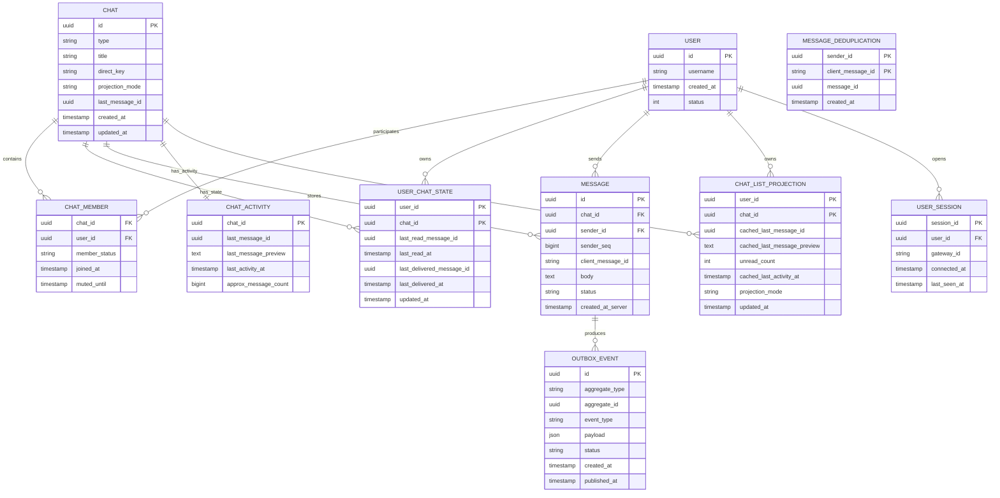
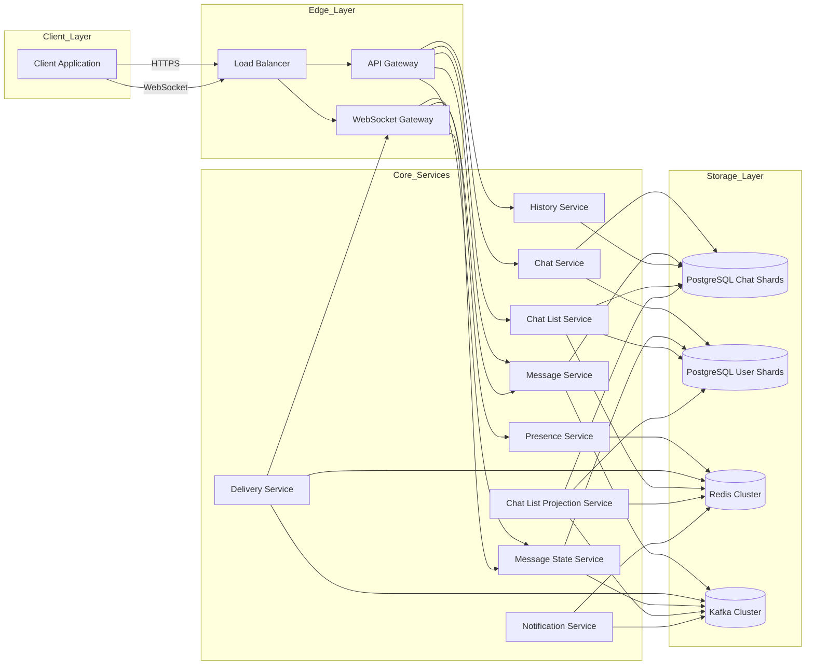
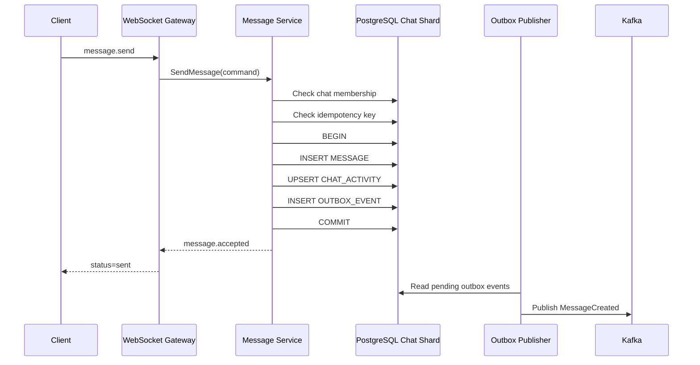
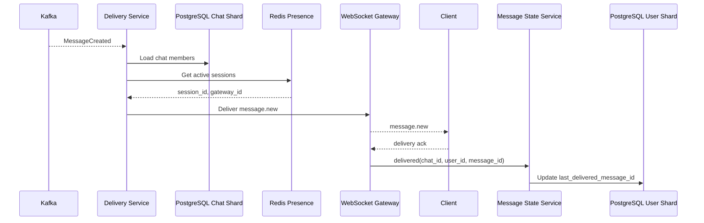
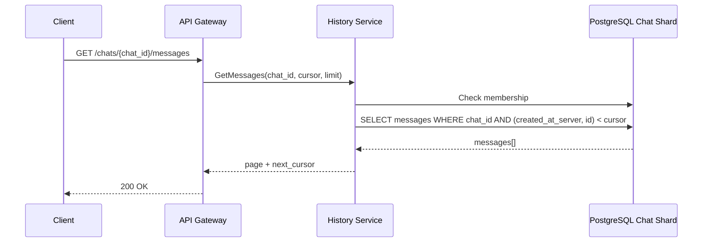
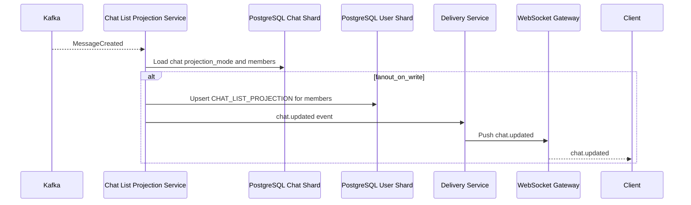
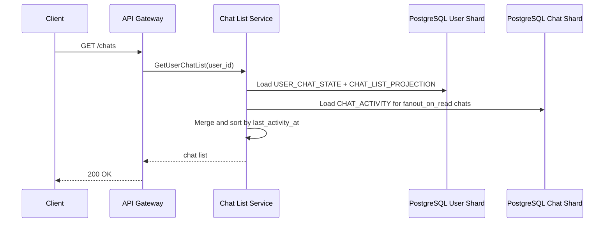
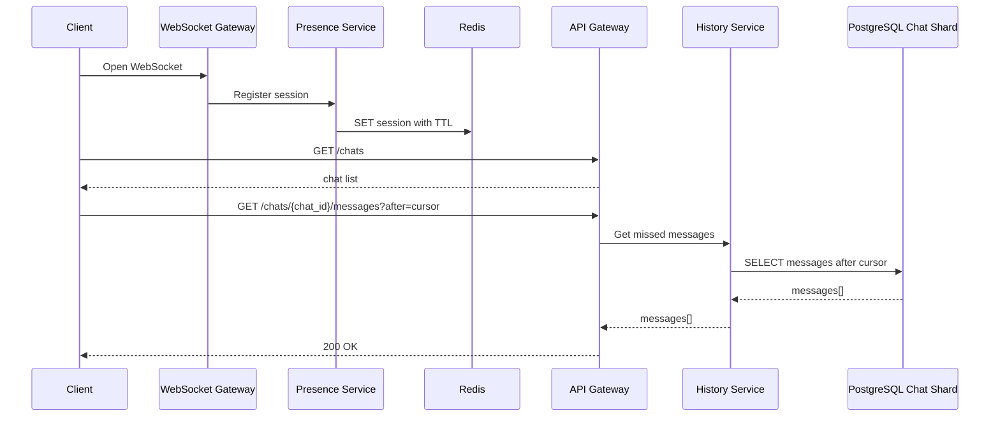
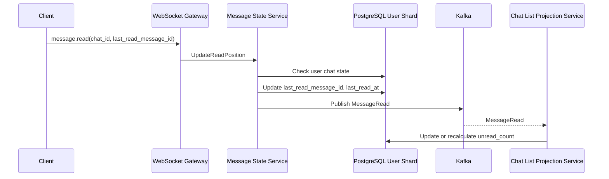
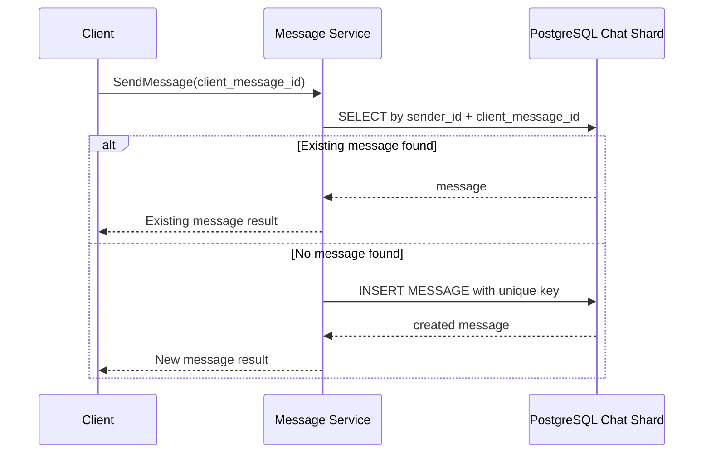

# Техническое решение проекта «Мессенджер»

## Содержание

1. [Введение](#1-введение)  
2. [Постановка задачи и границы системы](#2-постановка-задачи-и-границы-системы)  
3. [Глоссарий](#3-глоссарий)  
4. [Функциональные требования](#4-функциональные-требования)  
5. [Нефункциональные требования](#5-нефункциональные-требования)  
6. [Пользовательские сценарии](#6-пользовательские-сценарии)  
7. [API системы](#7-api-системы)  
8. [Модель данных](#8-модель-данных)  
9. [Архитектура системы](#9-архитектура-системы)  
10. [Технические сценарии](#10-технические-сценарии)  
11. [Порядок, консистентность и идемпотентность](#11-порядок-консистентность-и-идемпотентность)  
12. [Шардирование, масштабирование и отказоустойчивость](#12-шардирование-масштабирование-и-отказоустойчивость)  
13. [Наблюдаемость и эксплуатация](#13-наблюдаемость-и-эксплуатация)  
14. [Компромиссы и ограничения архитектуры](#14-компромиссы-и-ограничения-архитектуры)  
15. [Заключение](#15-заключение)  

---

## 1. Введение

Мессенджер относится к классу распределённых интерактивных систем, в которых требуется совмещать высокую скорость обработки пользовательских действий, сохранность данных и устойчивость к частичным сбоям инфраструктуры. Особенность таких систем состоит в одновременном наличии высокой нагрузки на запись, интенсивного чтения истории сообщений и большого числа долгоживущих соединений с клиентскими приложениями.

С технической точки зрения мессенджер объединяет несколько типов задач: приём и фиксацию сообщений, доставку событий активным пользователям, хранение истории переписки, восстановление состояния после повторного подключения, управление онлайн-статусом и обработку повторных запросов. Эти задачи имеют разные требования к задержкам, консистентности и масштабированию, поэтому архитектура системы должна разделять критический контур записи и вторичные контуры доставки, счётчиков, списков чатов и статусов.

Предлагаемое решение описывает архитектуру сервиса обмена текстовыми сообщениями для личных диалогов и групповых чатов. В качестве основных механизмов используются горизонтально масштабируемые сервисы, постоянное хранилище сообщений, брокер событий, кэширование и отдельный контур WebSocket-соединений.

---

## 2. Постановка задачи и границы системы

### 2.1. Назначение системы

Система предназначена для обмена текстовыми сообщениями между пользователями в режиме, близком к реальному времени. Пользователь должен иметь возможность открыть список чатов, просмотреть историю переписки, отправить сообщение и получить новые сообщения от других участников.

### 2.2. Поддерживаемая функциональность

В решении рассматриваются следующие функции:

1. личные диалоги между двумя пользователями;
2. групповые чаты с несколькими участниками;
3. отправка и получение текстовых сообщений;
4. хранение истории переписки;
5. постраничная загрузка сообщений;
6. отображение списка чатов пользователя;
7. отображение последней активности в чате;
8. онлайн-доставка сообщений активным пользователям;
9. доступность сообщений для пользователей, которые были офлайн;
10. статусы сообщений `sent`, `delivered`, `read`;
11. защита от дублей при повторной отправке запроса;
12. базовое отображение онлайн-статуса пользователя.

### 2.3. Границы решения

В состав решения не включаются:

1. голосовые и видеозвонки;
2. отправка файлов и медиа;
3. голосовые сообщения;
4. сквозное шифрование пользовательских сообщений;
5. модерация контента;
6. сложные роли и права администраторов групп;
7. удаление сообщений для всех участников;
8. редактирование сообщений;
9. поиск по содержимому переписки.

Указанные функции могут быть добавлены в развитие архитектуры, однако они требуют отдельных сервисов, моделей данных и механизмов безопасности.

### 2.4. Ключевые архитектурные цели

Архитектура ориентирована на достижение следующих целей:

1. надёжная фиксация каждого принятого сообщения;
2. устойчивый порядок отображения сообщений в истории чата;
3. сохранение порядка сообщений одного отправителя;
3. доставка сообщений активным пользователям с малой задержкой;
4. возможность получения пропущенных сообщений после повторного подключения;
5. горизонтальное масштабирование контура записи, чтения истории и WebSocket-подключений;
6. устойчивость к сбоям отдельных экземпляров сервисов;
8. предотвращение дублей при повторных клиентских запросах и повторной обработке внутренних событий;
9. разделение синхронных и асинхронных операций;
10. ограничение write amplification для крупных групповых чатов.

---

## 3. Глоссарий

| Термин | Определение |
|---|---|
| Пользователь | Учётная запись участника системы, имеющая уникальный идентификатор. |
| Чат | Канал общения между пользователями. В системе поддерживаются личные диалоги и групповые чаты. |
| Личный диалог | Чат с двумя участниками. |
| Групповой чат | Чат с тремя и более участниками. |
| Участник чата | Пользователь, связанный с конкретным чатом через запись членства. |
| Сообщение | Текстовая единица переписки, отправленная пользователем в чат. |
| История сообщений | Упорядоченный набор сообщений внутри чата. |
| Доставка сообщения | Передача сообщения в активную пользовательскую сессию либо обеспечение доступности сообщения после повторного подключения. |
| Статус `sent` | Сообщение принято системой и зафиксировано в постоянном хранилище. |
| Статус `delivered` | Сообщение доставлено активной сессии получателя либо стало доступно участникам чата в истории. |
| Статус `read` | Сообщение прочитано пользователем. |
| Онлайн-статус | Признак наличия активной пользовательской сессии. |
| WebSocket-сессия | Долгоживущее соединение между клиентским приложением и сервером для получения событий в реальном времени. |
| Cursor | Указатель на позицию в истории сообщений для постраничной загрузки. |
| Idempotency key | Уникальный ключ клиентской операции, позволяющий безопасно повторить запрос без создания дубля. |
| Модель чтения | Производное представление данных, оптимизированное для частого чтения. |
| Fan-out | Рассылка события нескольким получателям. |
| Fanout-on-write | Подход, при котором производные данные для получателей обновляются в момент записи исходного события. |
| Fanout-on-read | Подход, при котором часть производных данных вычисляется или актуализируется при чтении. |
| Backpressure | Ограничение темпа обработки для защиты системы от перегрузки. |
| Source of truth | Основное хранилище, содержащее авторитетное состояние данных. |
| Логический шард | Абстрактная единица разбиения данных, которая может быть размещена на одном из физических шардов. |
| Физический шард | Отдельный узел или кластер хранилища, содержащий часть данных системы. |
| Write amplification | Рост числа операций записи, возникающий при обработке одного пользовательского события. |

---

## 4. Функциональные требования

### 4.1. Личные диалоги

Система должна поддерживать создание и открытие личного диалога между двумя пользователями.

Для личного диалога должны храниться:

1. уникальный идентификатор чата;
2. тип чата;
3. идентификаторы двух участников;
4. время создания;
5. идентификатор и время последнего сообщения;
6. состояние чата для каждого участника.

Повторное создание личного диалога между одной и той же парой пользователей должно возвращать существующий диалог.

### 4.2. Групповые чаты

Система должна поддерживать создание групповых чатов и добавление участников.

Для группового чата должны храниться:

1. уникальный идентификатор чата;
2. тип чата;
3. название чата;
4. список участников;
5. время создания;
6. время последней активности;
7. параметры чтения и уведомлений для каждого участника.

Удаление участников и сложная ролевая модель не рассматриваются.

### 4.3. Список чатов пользователя

Система должна предоставлять пользователю список доступных чатов.

Для каждого элемента списка должны отображаться:

1. идентификатор чата;
2. тип чата;
3. название или отображаемое имя собеседника;
4. последнее сообщение или его краткое представление;
5. время последнего сообщения;
6. счётчик непрочитанных сообщений;
7. признак онлайн-статуса собеседника для личного диалога;
8. состояние доставки и чтения последнего исходящего сообщения.

Список чатов сортируется по времени последней активности в порядке убывания.

### 4.4. Отправка сообщений

Система должна позволять пользователю отправлять текстовое сообщение в личный диалог или групповой чат.

При отправке сообщения система должна:

1. проверить членство отправителя в чате;
2. проверить корректность текста сообщения;
3. обработать идемпотентный ключ клиентской операции;
4. зафиксировать сообщение в постоянном хранилище;
5. назначить сообщению серверный идентификатор и время фиксации;
6. сохранить порядковый номер сообщения отправителя в рамках чата, если он передан клиентом или назначается сервером;
7. вернуть клиенту подтверждение приёма;
8. сформировать событие для последующей доставки участникам чата.

Каждое сообщение должно содержать:

1. `message_id`;
2. `chat_id`;
3. `sender_id`;
4. `sender_seq`;
5. текст сообщения;
6. время создания на сервере;
7. клиентский идентификатор операции;
8. статус обработки.

### 4.5. Получение сообщений

Система должна обеспечивать получение новых сообщений активными пользователями через WebSocket-соединение.

При наличии активной сессии получателя сообщение передаётся в соответствующий WebSocket Gateway. При отсутствии активной сессии сообщение остаётся доступным в истории чата и будет получено пользователем при следующем открытии чата или восстановлении соединения.

### 4.6. История сообщений

Система должна предоставлять постраничную загрузку истории сообщений.

Требования к истории:

1. сообщения выдаются в устойчивом порядке внутри одного чата;
2. порядок сообщений определяется парой `(created_at_server, message_id)`, где `created_at_server` фиксирует время сохранения сообщения на сервере, а `message_id` используется для разрешения совпадений по времени;
3. пагинация выполняется по cursor, основанному на паре `(created_at_server, message_id)`;
4. при загрузке более старых сообщений cursor формируется по самому старому сообщению текущей страницы и используется как верхняя граница следующего запроса;
5. при получении новых сообщений после повторного подключения cursor формируется по последнему известному клиенту сообщению и используется как нижняя граница следующего запроса;
6. при повторном запросе одной страницы не должны появляться пропуски или дубли;
7. чтение старых страниц не должно блокировать запись новых сообщений;
8. пользователь может читать только те чаты, где он является участником;
9. сообщения одного отправителя отображаются в порядке их отправки.

### 4.7. Статусы сообщений

Система должна поддерживать состояния `sent`, `delivered`, `read`.

Модель статусов задаётся следующим образом:

1. `sent` фиксируется после успешной записи сообщения в основное хранилище;
2. `delivered` для личного диалога фиксируется после передачи сообщения активной сессии получателя либо после подтверждения получения клиентом;
3. `delivered` для группового чата означает, что сообщение зафиксировано и доступно всем участникам чата;
4. `read` фиксируется через обновление позиции чтения пользователя в чате;
5. для групповых чатов чтение хранится как позиция последнего прочитанного сообщения по каждому участнику.

Использование позиции чтения снижает объём записей по сравнению с хранением отдельного статуса для каждого сообщения и каждого участника.

### 4.8. Онлайн-статус

Система должна определять наличие активных пользовательских сессий.

Онлайн-статус обновляется через WebSocket-подключение и периодические heartbeat-события. Состояние присутствия хранится в Redis с ограниченным временем жизни. Завершение сессии или истечение TTL переводит пользователя в состояние офлайн.

### 4.9. Работа с офлайн-пользователями

Система должна обеспечивать доступность сообщений для пользователей, которые не были подключены в момент отправки.

Для этого:

1. сообщение сначала фиксируется в постоянном хранилище;
2. доставка через WebSocket выполняется как вторичная операция;
3. при повторном подключении клиент запрашивает историю с последней известной позиции;
4. счётчики непрочитанных сообщений формируются на основе позиции чтения и производных представлений.

### 4.10. Защита от дублей

Система должна предотвращать дублирование сообщений при повторной отправке клиентского запроса, повторной обработке события и сбоях сети.

Для этого используется уникальная пара:

```text
(sender_id, client_message_id)
```

При повторном получении запроса с тем же ключом система возвращает ранее созданное сообщение, не создавая новую запись.

---

## 5. Нефункциональные требования

### 5.1. Нагрузка

Целевые показатели нагрузки:

1. до 50 000 отправок сообщений в секунду в пике;
2. до 200 000 запросов в секунду на чтение истории, получение новых сообщений и обновление списков чатов;
3. большое число одновременно открытых WebSocket-соединений;
4. преобладание коротких операций записи и частых операций чтения;
5. повышенная стоимость доставки одного сообщения в групповые чаты.

### 5.2. Производительность

Целевые показатели задержек:

1. приём сообщения системой — P95 не более 100 мс;
2. доставка онлайн-получателю — в типовом случае не более 1 секунды;
3. получение истории сообщений — P95 не более 150–200 мс;
4. обновление списка чатов — P95 не более 200 мс;
5. обновление позиции чтения — P95 не более 100 мс.

### 5.3. Надёжность

Система должна обеспечивать:

1. отсутствие потери сообщений, принятых системой;
2. корректную обработку повторных клиентских запросов;
3. восстановление доставки после временных сбоев;
4. устойчивость к отказу отдельных экземпляров сервисов;
5. повторную обработку событий без нарушения целостности данных;
6. возможность восстановления производных представлений из основного хранилища и журнала событий.

### 5.4. Консистентность

Для записи сообщения требуется строгая фиксация в основном хранилище. Статус `sent` может быть возвращён только после успешной записи.

Для вторичных данных допускается отложенная согласованность:

1. счётчики непрочитанных сообщений;
2. список чатов;
3. проекции последнего сообщения;
4. онлайн-статус;
5. агрегированные статусы доставки в групповых чатах.

Порядок сообщений внутри одного чата должен быть определён, устойчив и воспроизводим при чтении истории. Строгий глобальный порядок всех конкурентно отправленных сообщений внутри крупного чата не является обязательным требованием, если сохраняется устойчивый порядок отображения и порядок сообщений одного отправителя.

### 5.5. Масштабируемость

Система должна масштабироваться горизонтально по независимым контурам:

1. приём сообщений;
2. запись сообщений;
3. доставка сообщений;
4. хранение истории;
5. чтение истории;
6. WebSocket-подключения;
7. хранение и обновление онлайн-статуса;
8. обновление списков чатов;
9. обработка счётчиков непрочитанных сообщений.

### 5.6. Безопасность

Система должна обеспечивать:

1. аутентификацию пользователя;
2. проверку доступа к каждому чату;
3. запрет чтения чужих сообщений;
4. запрет отправки сообщений в чаты, где пользователь не является участником;
5. ограничение частоты запросов;
6. защиту WebSocket-соединений через токены доступа;
7. хранение служебных идентификаторов без передачи лишних внутренних данных клиенту.

### 5.7. Эксплуатационные требования

Система должна поддерживать:

1. централизованное логирование;
2. сбор метрик по задержкам и ошибкам;
3. трассировку запросов между сервисами;
4. алерты по росту задержек, ошибок и лагов обработки событий;
5. безопасное развёртывание новых версий сервисов;
6. возможность восстановления моделей чтения.

---

## 6. Пользовательские сценарии

### 6.1. Просмотр списка чатов

1. Пользователь открывает приложение.
2. Клиентское приложение отправляет запрос на получение списка чатов.
3. Система проверяет аутентификацию пользователя.
4. Chat List Service получает список чатов пользователя.
5. Для чатов с режимом `fanout_on_write` используются заранее обновлённые строки `CHAT_LIST_PROJECTION`.
6. Для крупных чатов с режимом `fanout_on_read` данные последней активности дополняются из `CHAT_ACTIVITY`.
7. Система возвращает список чатов, отсортированный по времени последней активности.
8. Клиент отображает последнее сообщение, счётчики непрочитанных сообщений и онлайн-статус.

### 6.2. Открытие личного диалога

1. Пользователь выбирает личный диалог.
2. Клиент запрашивает первую страницу истории сообщений.
3. Система проверяет членство пользователя в чате.
4. History Service возвращает последние сообщения в порядке `(created_at_server, message_id)`.
5. Клиент отображает историю.
6. Клиент открывает WebSocket-подписку на события выбранного чата.

### 6.3. Создание личного диалога

1. Пользователь выбирает другого пользователя и инициирует личный диалог.
2. Система проверяет наличие существующего диалога между этими пользователями.
3. Если диалог существует, возвращается его `chat_id`.
4. Если диалог отсутствует, создаётся новая запись типа `direct`.
5. Для обоих участников создаются записи членства в чате.
6. Для обоих участников создаются пользовательские состояния чата.

### 6.4. Создание группового чата

1. Пользователь выбирает несколько участников.
2. Клиент отправляет запрос на создание группового чата.
3. Система создаёт запись чата типа `group`.
4. Для каждого выбранного пользователя создаётся запись членства.
5. Для каждого участника создаётся пользовательское состояние чата.
6. Для чата определяется режим обновления списка чатов. По умолчанию для малых групп используется `fanout_on_write`.
7. Создатель получает идентификатор созданного чата.
8. Остальным участникам формируется событие о появлении нового чата.

### 6.5. Отправка сообщения

1. Пользователь вводит текст и нажимает кнопку отправки.
2. Клиент формирует `client_message_id`.
3. Клиент передаёт `sender_seq`, отражающий порядок отправки сообщений данным пользователем в выбранном чате.
4. Запрос отправляется в Message Service через API Gateway или WebSocket Gateway.
5. Message Service проверяет право отправки в чат.
6. Message Service фиксирует сообщение в базе данных.
7. Система возвращает отправителю сообщение со статусом `sent`.
8. Событие о новом сообщении передаётся в Kafka.
9. Delivery Service доставляет событие активным участникам чата.
10. Chat List Projection Service обновляет список чатов по выбранной стратегии: при записи для малых чатов или при чтении для крупных чатов.

### 6.6. Получение сообщения онлайн-пользователем

1. Получатель имеет активное WebSocket-соединение.
2. Presence Service содержит сведения об активной сессии пользователя.
3. Delivery Service определяет WebSocket Gateway, обслуживающий сессию получателя.
4. Сообщение передаётся в WebSocket Gateway.
5. WebSocket Gateway отправляет событие клиентскому приложению.
6. Клиент подтверждает получение.
7. Система обновляет состояние доставки.

### 6.7. Получение сообщений после офлайн-периода

1. Пользователь открывает приложение после периода отсутствия подключения.
2. Клиент устанавливает WebSocket-соединение.
3. Presence Service регистрирует активную сессию.
4. Клиент запрашивает список чатов и историю с последней сохранённой позиции.
5. History Service возвращает сообщения, созданные после указанного cursor.
6. Счётчики непрочитанных сообщений пересчитываются или читаются из модели чтения.

### 6.8. Прочтение сообщений

1. Пользователь открывает чат.
2. Клиент определяет максимальное отображённое сообщение.
3. Клиент отправляет событие обновления позиции чтения.
4. Message State Service обновляет позицию чтения участника.
5. Chat List Service обновляет или пересчитывает счётчик непрочитанных сообщений.
6. В личном диалоге отправителю может быть передано событие о прочтении.

### 6.9. Повторная отправка сообщения при сетевом сбое

1. Клиент отправляет сообщение, но не получает ответ из-за сетевого сбоя.
2. Клиент повторяет запрос с тем же `client_message_id`.
3. Message Service находит ранее созданное сообщение по уникальному ключу.
4. Новая запись не создаётся.
5. Клиент получает данные ранее зафиксированного сообщения.

## 7. API системы

### 7.1. REST API

#### 7.1.1. Чаты

| Метод | Эндпоинт | Назначение |
|---|---|---|
| `GET` | `/chats` | Получить список чатов пользователя |
| `POST` | `/chats/direct` | Создать или открыть личный диалог |
| `POST` | `/chats/group` | Создать групповой чат |
| `GET` | `/chats/{chat_id}` | Получить сведения о чате |
| `POST` | `/chats/{chat_id}/members` | Добавить участников в групповой чат |
| `GET` | `/chats/{chat_id}/members` | Получить список участников чата |

#### 7.1.2. Сообщения

| Метод | Эндпоинт | Назначение |
|---|---|---|
| `POST` | `/chats/{chat_id}/messages` | Отправить сообщение |
| `GET` | `/chats/{chat_id}/messages?limit={limit}&before={cursor}` | Получить страницу истории сообщений |
| `POST` | `/chats/{chat_id}/read` | Обновить позицию чтения |
| `GET` | `/messages/{message_id}` | Получить данные конкретного сообщения |

#### 7.1.3. Состояние пользователя

| Метод | Эндпоинт | Назначение |
|---|---|---|
| `GET` | `/users/{user_id}/presence` | Получить онлайн-статус пользователя |
| `POST` | `/sessions/logout` | Завершить пользовательскую сессию |

### 7.2. WebSocket API

WebSocket используется для доставки событий в реальном времени.

#### 7.2.1. Входящие клиентские события

| Событие | Назначение |
|---|---|
| `message.send` | Отправка сообщения |
| `chat.open` | Подписка на события активного чата |
| `chat.close` | Завершение активного просмотра чата |
| `message.read` | Обновление позиции чтения |
| `presence.heartbeat` | Поддержание активного онлайн-статуса |

#### 7.2.2. Исходящие серверные события

| Событие | Назначение |
|---|---|
| `message.accepted` | Подтверждение фиксации сообщения |
| `message.new` | Новое сообщение в чате |
| `message.delivered` | Обновление статуса доставки |
| `message.read` | Обновление статуса прочтения |
| `chat.updated` | Изменение списка чатов или последней активности |
| `presence.updated` | Изменение онлайн-статуса пользователя |
| `error` | Ошибка обработки события |

### 7.3. Формат отправки сообщения

```json
{
  "client_message_id": "d90d6e8c-3e5a-4d46-923a-9f3a64d3d221",
  "sender_seq": 154,
  "text": "Текст сообщения"
}
```

### 7.4. Формат ответа на отправку сообщения

```json
{
  "message_id": "01J4QJ3B0N1ZJQ2AD9X5Y3H6K8",
  "chat_id": "9b36cf2d-78cc-4be0-a5db-610f8811f1a1",
  "sender_id": "4d2f48f2-d542-4a57-8e8e-63aa8d3c98f1",
  "sender_seq": 154,
  "text": "Текст сообщения",
  "status": "sent",
  "created_at_server": "2026-05-20T10:15:30.123Z"
}
```

---

## 8. Модель данных

### 8.1. Общая характеристика модели

Основное состояние системы хранится в PostgreSQL. Сообщения, чаты, участники и позиции чтения являются критичными данными. Redis используется для краткоживущего состояния присутствия, кэша моделей чтения и ускоренного доступа к часто используемым данным. Kafka используется как журнал событий для асинхронной доставки и обновления производных представлений.

Модель данных разделяется на два контура:

1. контур чатов и сообщений, шардируемый по `chat_id`;
2. контур пользовательских состояний и списков чатов, шардируемый по `user_id`.

Такое разделение отражает разные шаблоны доступа. История сообщений читается по конкретному чату, а список чатов и пользовательские состояния читаются по конкретному пользователю.

### 8.2. Основные сущности



### 8.3. Таблица `USER`

| Поле | Тип | Назначение |
|---|---|---|
| `id` | `uuid` | Уникальный идентификатор пользователя |
| `username` | `varchar` | Отображаемое имя пользователя |
| `created_at` | `timestamp` | Время создания учётной записи |
| `status` | `int` | Служебный статус учётной записи |

Индексы:

1. `PRIMARY KEY (id)`;
2. `UNIQUE (username)` при наличии требования уникальности имени.

### 8.4. Таблица `CHAT`

| Поле | Тип | Назначение |
|---|---|---|
| `id` | `uuid` | Уникальный идентификатор чата |
| `type` | `varchar` | Тип чата: `direct` или `group` |
| `title` | `varchar` | Название группового чата |
| `direct_key` | `varchar` | Уникальный ключ пары пользователей для личного диалога |
| `projection_mode` | `varchar` | Режим обновления списка чатов: `fanout_on_write` или `fanout_on_read` |
| `last_message_id` | `uuid` | Идентификатор последнего сообщения |
| `created_at` | `timestamp` | Время создания |
| `updated_at` | `timestamp` | Время последней активности |

Индексы:

1. `PRIMARY KEY (id)`;
2. `UNIQUE (direct_key)` для личных диалогов;
3. `INDEX (updated_at DESC)` для фоновых операций.

### 8.5. Таблица `CHAT_MEMBER`

| Поле | Тип | Назначение |
|---|---|---|
| `chat_id` | `uuid` | Идентификатор чата |
| `user_id` | `uuid` | Идентификатор пользователя |
| `member_status` | `varchar` | Состояние членства |
| `joined_at` | `timestamp` | Время добавления в чат |
| `muted_until` | `timestamp` | Время отключения уведомлений |

Индексы:

1. `PRIMARY KEY (chat_id, user_id)`;
2. `INDEX (user_id, chat_id)`;
3. `INDEX (chat_id)`.

Таблица `CHAT_MEMBER` хранится в контуре чата и шардируется по `chat_id`, поскольку при доставке сообщения требуется получить участников конкретного чата.

### 8.6. Таблица `USER_CHAT_STATE`

Таблица хранит индивидуальное состояние пользователя в чате и шардируется по `user_id`.

| Поле | Тип | Назначение |
|---|---|---|
| `user_id` | `uuid` | Пользователь |
| `chat_id` | `uuid` | Чат |
| `last_read_message_id` | `uuid` | Последнее прочитанное сообщение |
| `last_read_at` | `timestamp` | Время последнего прочитанного сообщения |
| `last_delivered_message_id` | `uuid` | Последнее доставленное сообщение |
| `last_delivered_at` | `timestamp` | Время последней доставленной позиции |
| `updated_at` | `timestamp` | Время последнего обновления состояния |

Индексы:

1. `PRIMARY KEY (user_id, chat_id)`;
2. `INDEX (user_id, updated_at DESC)`;
3. `INDEX (chat_id, user_id)` для фоновых сверок.

Разделение `CHAT_MEMBER` и `USER_CHAT_STATE` позволяет локализовать операции доставки по `chat_id`, а операции чтения пользовательского списка чатов — по `user_id`.

### 8.7. Таблица `MESSAGE`

| Поле | Тип | Назначение |
|---|---|---|
| `id` | `uuid`, `ulid` или `uuidv7` | Уникальный идентификатор сообщения |
| `chat_id` | `uuid` | Идентификатор чата |
| `sender_id` | `uuid` | Автор сообщения |
| `sender_seq` | `bigint` | Порядковый номер сообщения данного отправителя в рамках чата |
| `client_message_id` | `varchar` | Клиентский идентификатор операции |
| `body` | `text` | Текст сообщения |
| `status` | `varchar` | Системный статус сообщения |
| `created_at_server` | `timestamp` | Время фиксации на сервере |

Индексы:

1. `PRIMARY KEY (id)`;
2. `UNIQUE (sender_id, client_message_id)`;
3. `UNIQUE (chat_id, sender_id, sender_seq)`;
4. `INDEX (chat_id, created_at_server DESC, id DESC)`;
5. `INDEX (chat_id, id DESC)`.

Поле `sender_seq` не является глобальным счётчиком чата. Оно используется для сохранения порядка сообщений одного отправителя. Основной устойчивый порядок отображения истории задаётся парой `(created_at_server, id)`.

### 8.8. Таблица `MESSAGE_DEDUPLICATION`

Таблица используется для явной фиксации идемпотентности клиентских операций. В упрощённой реализации её роль может выполнять уникальный индекс `UNIQUE (sender_id, client_message_id)` в таблице `MESSAGE`.

| Поле | Тип | Назначение |
|---|---|---|
| `sender_id` | `uuid` | Отправитель сообщения |
| `client_message_id` | `varchar` | Клиентский ключ операции |
| `message_id` | `uuid` | Ранее созданное сообщение |
| `created_at` | `timestamp` | Время регистрации ключа |

### 8.9. Таблица `CHAT_ACTIVITY`

Таблица хранит агрегированную последнюю активность чата и используется при чтении списков чатов, особенно для крупных групп.

| Поле | Тип | Назначение |
|---|---|---|
| `chat_id` | `uuid` | Идентификатор чата |
| `last_message_id` | `uuid` | Последнее сообщение |
| `last_message_preview` | `text` | Краткое представление последнего сообщения |
| `last_activity_at` | `timestamp` | Время последней активности |
| `approx_message_count` | `bigint` | Приблизительное количество сообщений |

Индексы:

1. `PRIMARY KEY (chat_id)`;
2. `INDEX (last_activity_at DESC)`.

Для крупных групп новое сообщение обновляет `CHAT_ACTIVITY`, но не приводит к массовому обновлению `CHAT_LIST_PROJECTION` для всех участников.

### 8.10. Таблица `OUTBOX_EVENT`

Таблица обеспечивает атомарную связь между записью сообщения и публикацией события.

| Поле | Тип | Назначение |
|---|---|---|
| `id` | `uuid` | Идентификатор события |
| `aggregate_type` | `varchar` | Тип агрегата |
| `aggregate_id` | `uuid` | Идентификатор агрегата |
| `event_type` | `varchar` | Тип события |
| `payload` | `jsonb` | Данные события |
| `status` | `varchar` | Состояние публикации |
| `created_at` | `timestamp` | Время создания |
| `published_at` | `timestamp` | Время публикации |

Индексы:

1. `PRIMARY KEY (id)`;
2. `INDEX (status, created_at)`;
3. `UNIQUE (event_type, aggregate_id)` для защиты от повторной публикации критичных событий.

### 8.11. Таблица `CHAT_LIST_PROJECTION`

Модель чтения используется для быстрого отображения списка чатов пользователя.

| Поле | Тип | Назначение |
|---|---|---|
| `user_id` | `uuid` | Владелец списка |
| `chat_id` | `uuid` | Чат |
| `cached_last_message_id` | `uuid` | Последнее сообщение, сохранённое в проекции |
| `cached_last_message_preview` | `text` | Краткое представление последнего сообщения |
| `unread_count` | `int` | Количество непрочитанных сообщений |
| `cached_last_activity_at` | `timestamp` | Время последней активности в проекции |
| `projection_mode` | `varchar` | Режим обновления проекции |
| `updated_at` | `timestamp` | Время обновления строки |

Индексы:

1. `PRIMARY KEY (user_id, chat_id)`;
2. `INDEX (user_id, cached_last_activity_at DESC)`;
3. `INDEX (user_id, unread_count)`.

Для личных диалогов и малых групп эта таблица обновляется при записи сообщения. Для крупных групп она используется как базовый пользовательский список, а актуальные данные последней активности дополняются из `CHAT_ACTIVITY` при чтении.

### 8.12. Состояние присутствия в Redis

Онлайн-сессии хранятся в Redis:

```text
presence:user:{user_id} -> set(session_id)
session:{session_id} -> { user_id, gateway_id, connected_at, last_seen_at }
gateway:sessions:{gateway_id} -> set(session_id)
```

Ключи имеют TTL и обновляются heartbeat-событиями. При отсутствии heartbeat состояние сессии автоматически истекает.

### 8.13. Шардирование данных

Данные системы распределяются по двум основным ключам шардирования.

#### 8.13.1. Контур чатов

По `chat_id` шардируются:

1. `CHAT`;
2. `CHAT_MEMBER`;
3. `MESSAGE`;
4. `CHAT_ACTIVITY`;
5. `OUTBOX_EVENT` для событий конкретного чата.

Такой подход позволяет хранить историю одного чата и список его участников на одном логическом шарде. Чтение истории и проверка членства при отправке сообщения выполняются без обращения ко всем шардам.

#### 8.13.2. Контур пользователей

По `user_id` шардируются:

1. `USER`;
2. `USER_CHAT_STATE`;
3. `CHAT_LIST_PROJECTION`;
4. пользовательские настройки;
5. пользовательские сессии при хранении в постоянном хранилище.

Такой подход оптимизирован для сценариев, где пользователь открывает свой список чатов, получает счётчики непрочитанных сообщений и читает индивидуальное состояние.

#### 8.13.3. Связь между контурами

Связь между чатом и пользователем хранится в двух направлениях:

```text
chat_id -> список участников
user_id -> список чатов пользователя
```

Это приводит к частичному дублированию данных, но снижает стоимость основных операций чтения. Авторитетное членство в чате хранится в `CHAT_MEMBER`, а пользовательское состояние и список чатов — в `USER_CHAT_STATE` и `CHAT_LIST_PROJECTION`.

#### 8.13.4. Алгоритм шардирования

Для сообщений и сущностей контура чата используется хэширование по `chat_id`:

```text
logical_shard_id = hash(chat_id) mod 64
```

Для пользовательских состояний используется хэширование по `user_id`:

```text
logical_shard_id = hash(user_id) mod 64
```

Логические шарды сопоставляются с физическими узлами через таблицу маршрутизации:

```text
logical_shard_id -> physical_shard_id
```

Использование логических шардов позволяет перераспределять данные между физическими узлами без изменения ключа шардирования.

#### 8.13.5. Оценка числа шардов

Целевая пиковая нагрузка составляет до 50 000 отправок сообщений в секунду. Одна отправка сообщения включает не только вставку строки в `MESSAGE`, но и проверку членства, проверку идемпотентности, запись outbox-события, обновление активности чата, индексы, WAL и репликацию.

Для начального расчёта принимается ориентировочная безопасная нагрузка 3 000–6 000 отправок сообщений в секунду на один физический шард PostgreSQL. Тогда для обработки 50 000 отправок сообщений в секунду требуется:

```text
50 000 / 6 000 ≈ 8,3
50 000 / 3 000 ≈ 16,7
```

Следовательно, на начальном этапе целесообразно предусмотреть 8–16 физических шардов PostgreSQL и 64 логических шарда. Фактическое число физических шардов уточняется по результатам нагрузочного тестирования, поскольку оно зависит от размера сообщений, числа индексов, параметров репликации, характеристик дисковой подсистемы и доли крупных групповых чатов.

## 9. Архитектура системы

### 9.1. Общий подход

Архитектура строится на разделении синхронного контура записи и асинхронного контура доставки. Синхронный контур отвечает за проверку доступа, идемпотентность и фиксацию сообщения. Асинхронный контур отвечает за доставку активным пользователям, обновление моделей чтения, счётчиков и вторичных статусов.

Основные компоненты системы являются stateless, за исключением хранилищ, брокера сообщений и состояния WebSocket-сессий.

### 9.2. Основные компоненты

1. **Load Balancer** — распределяет входящий HTTP- и WebSocket-трафик между экземплярами API Gateway и WebSocket Gateway.

2. **API Gateway** — выполняет аутентификацию, проверку токенов, ограничение частоты запросов и маршрутизацию HTTP-запросов к внутренним сервисам.

3. **WebSocket Gateway** — поддерживает долгоживущие соединения с клиентами, принимает клиентские события и отправляет серверные события пользователям.

4. **Chat Service** — управляет чатами, личными диалогами, групповыми чатами и участниками.

5. **Message Service** — принимает сообщения, проверяет права доступа, обеспечивает идемпотентность и фиксирует сообщения в PostgreSQL.

6. **History Service** — отвечает за чтение истории сообщений и cursor-based пагинацию.

7. **Delivery Service** — потребляет события о новых сообщениях из Kafka и доставляет их активным участникам через WebSocket Gateway.

8. **Presence Service** — управляет онлайн-статусом пользователей и хранит сведения об активных сессиях в Redis.

9. **Message State Service** — обрабатывает статусы доставки и чтения, обновляет позиции прочтения и доставки.

10. **Chat List Service** — формирует список чатов пользователя. Для малых чатов использует заранее обновлённую `CHAT_LIST_PROJECTION`, для крупных чатов дополняет пользовательскую проекцию агрегированными данными из `CHAT_ACTIVITY`.

11. **Chat List Projection Service** — обновляет модели чтения списка чатов на основе событий. Для крупных групп ограничивает массовые обновления и использует стратегию актуализации при чтении.

12. **Notification Service** — формирует внешние уведомления для пользователей, которые не имеют активной сессии. В рамках текущего решения уведомления рассматриваются как дополнительный канал, не влияющий на сохранность сообщения.

13. **PostgreSQL Cluster** — основное хранилище чатов, участников, сообщений, пользовательских состояний и outbox-событий.

14. **Kafka Cluster** — брокер событий для доставки сообщений и обновления производных представлений.

15. **Redis Cluster** — хранилище присутствия, краткоживущих сессий, кэшей и быстрых счётчиков.

### 9.3. Архитектурная схема



### 9.4. Синхронный контур записи

Синхронный контур выполняется при отправке сообщения и включает:

1. аутентификацию пользователя;
2. проверку членства в чате;
3. проверку `client_message_id`;
4. генерацию `message_id`;
5. запись сообщения в PostgreSQL;
6. обновление `CHAT_ACTIVITY`;
7. запись события в outbox;
8. возврат клиенту статуса `sent`.

Доставка сообщения другим участникам и обновление пользовательских списков чатов не входят в критический синхронный путь. Это снижает задержку отправки и уменьшает зависимость записи от состояния WebSocket-инфраструктуры и сервисов моделей чтения.

### 9.5. Асинхронный контур доставки

Асинхронный контур начинается после публикации события `MessageCreated`.

Он включает:

1. чтение события из Kafka;
2. получение списка участников чата;
3. определение активных сессий через Presence Service;
4. отправку события в соответствующие WebSocket Gateway;
5. обновление статусов доставки;
6. обновление моделей чтения списка чатов по выбранной стратегии;
7. формирование уведомлений для офлайн-пользователей.

Асинхронная обработка допускает повторное выполнение. Все обработчики должны быть идемпотентными.

### 9.6. Выбор PostgreSQL

PostgreSQL используется как основное хранилище в связи с необходимостью надёжной фиксации сообщений, транзакционного обновления связанных сущностей и поддержки индексов для чтения истории. Реляционная модель подходит для хранения чатов, участников, сообщений, пользовательских состояний и outbox-событий.

При росте нагрузки применяется партиционирование и шардирование. Контур чатов шардируется по `chat_id`, пользовательский контур — по `user_id`.

### 9.7. Выбор Kafka

Kafka используется для передачи событий между сервисами. Для мессенджера это позволяет отделить запись сообщения от доставки и обновления производных представлений.

Ключом Kafka-сообщения для событий сообщений является `chat_id`. Такое распределение сохраняет порядок обработки событий конкретного чата в пределах одной партиции. Для крупных чатов fan-out может дополнительно разбиваться на задачи по диапазонам участников.

### 9.8. Выбор Redis

Redis используется для данных, не являющихся единственным источником истины:

1. онлайн-сессии;
2. heartbeat-состояния;
3. краткоживущие кэши;
4. быстрые признаки активных подключений;
5. служебные данные маршрутизации WebSocket-сессий;
6. кэш последних страниц активных чатов.

Потеря данных Redis не должна приводить к потере сообщений. При необходимости состояние восстанавливается из PostgreSQL и Kafka.

### 9.9. WebSocket Gateway

WebSocket Gateway отделяется от бизнес-логики сообщений. Он отвечает за поддержание соединений и маршрутизацию событий между клиентом и внутренними сервисами.

Экземпляры WebSocket Gateway регистрируют активные сессии в Redis. Delivery Service использует эту информацию для выбора нужного gateway при доставке сообщений.

### 9.10. Стратегия обновления списка чатов

Для списка чатов применяется гибридная стратегия.

#### 9.10.1. Fanout-on-write для личных диалогов и малых групп

Для личных диалогов и малых групповых чатов новое сообщение обновляет `CHAT_LIST_PROJECTION` участников сразу после обработки события. Это увеличивает стоимость записи на количество участников, но обеспечивает очень быстрое чтение списка чатов:

```text
1 сообщение -> N обновлений CHAT_LIST_PROJECTION
```

При `N = 2` для личного диалога или `N <= 100` для малого группового чата такой подход остаётся допустимым.

#### 9.10.2. Fanout-on-read для крупных групп

Для крупных и высокоактивных групп новое сообщение обновляет только агрегированное состояние чата в `CHAT_ACTIVITY`. Пользовательская проекция актуализируется при открытии списка чатов или фоновым процессом.

```text
1 сообщение -> 1 обновление CHAT_ACTIVITY
```

При чтении список пользователя строится из:

1. `USER_CHAT_STATE`;
2. `CHAT_LIST_PROJECTION`;
3. `CHAT_ACTIVITY` для крупных групп;
4. `MESSAGE` при необходимости получить последнее сообщение.

Такой подход предотвращает появление тысяч операций записи на одно сообщение в крупном чате.

#### 9.10.3. Выбор режима

Режим задаётся в поле `CHAT.projection_mode`.

Базовые пороги:

1. личные диалоги — `fanout_on_write`;
2. группы до 100 участников — `fanout_on_write`;
3. группы от 1000 участников — `fanout_on_read`;
4. промежуточные случаи определяются по фактической активности чата.

Дополнительный критерий:

```text
fanout_cost = member_count * messages_per_second
```

Если расчётная стоимость fan-out превышает заданный порог, чат переводится в режим `fanout_on_read`.

## 10. Технические сценарии

### 10.1. Отправка сообщения

1. Клиент отправляет сообщение через WebSocket или HTTP.
2. Gateway проверяет токен доступа.
3. Запрос передаётся в Message Service.
4. Message Service проверяет членство отправителя в чате.
5. Message Service проверяет уникальность пары `(sender_id, client_message_id)`.
6. Message Service генерирует `message_id` и фиксирует `created_at_server`.
7. Сообщение записывается в PostgreSQL.
8. В той же транзакции обновляется `CHAT_ACTIVITY` и создаётся запись `OUTBOX_EVENT`.
9. Клиент получает подтверждение со статусом `sent`.
10. Outbox Publisher публикует событие `MessageCreated` в Kafka.



### 10.2. Доставка сообщения онлайн-получателю

1. Delivery Service получает событие `MessageCreated` из Kafka.
2. Delivery Service определяет участников чата.
3. Для каждого участника, кроме отправителя, проверяется наличие активных сессий в Redis.
4. При наличии активной сессии сообщение отправляется в соответствующий WebSocket Gateway.
5. WebSocket Gateway передаёт сообщение клиенту.
6. Клиент подтверждает получение.
7. Message State Service обновляет доставленную позицию пользователя.



### 10.3. Получение истории сообщений

1. Клиент отправляет запрос `GET /chats/{chat_id}/messages`.
2. API Gateway выполняет аутентификацию.
3. History Service проверяет членство пользователя в чате.
4. History Service выполняет запрос к PostgreSQL по индексу `(chat_id, created_at_server, id)`.
5. Сообщения возвращаются с cursor для следующей страницы.
6. Клиент отображает историю.



### 10.4. Обновление списка чатов для малых чатов

1. Kafka получает событие `MessageCreated`.
2. Chat List Projection Service определяет режим чата.
3. Если режим `fanout_on_write`, сервис получает список участников.
4. Для каждого участника обновляется `CHAT_LIST_PROJECTION`.
5. Для получателей увеличивается счётчик непрочитанных сообщений.
6. Для отправителя счётчик непрочитанных сообщений не увеличивается.
7. Активным пользователям отправляется событие `chat.updated`.



### 10.5. Обновление списка чатов для крупных чатов

1. Новое сообщение обновляет `CHAT_ACTIVITY` в синхронном контуре записи.
2. `CHAT_LIST_PROJECTION` всех участников крупного чата не обновляется при каждом сообщении.
3. Пользователь открывает список чатов.
4. Chat List Service читает пользовательские записи из `USER_CHAT_STATE` и `CHAT_LIST_PROJECTION`.
5. Для чатов с режимом `fanout_on_read` сервис получает актуальную активность из `CHAT_ACTIVITY`.
6. Итоговый список сортируется по максимальному времени активности.
7. При необходимости обновляется пользовательская строка проекции.



### 10.6. Повторное подключение пользователя

1. Клиент устанавливает новое WebSocket-соединение.
2. WebSocket Gateway регистрирует сессию в Presence Service.
3. Presence Service сохраняет сессию в Redis.
4. Клиент запрашивает список чатов.
5. Клиент запрашивает сообщения после последней локально сохранённой позиции.
6. History Service возвращает пропущенные сообщения.
7. Клиент обновляет локальное состояние.



### 10.7. Обновление статуса прочтения

1. Клиент отправляет `message.read` с идентификатором последнего прочитанного сообщения.
2. Message State Service проверяет членство пользователя в чате.
3. Позиция чтения обновляется монотонно относительно порядка `(created_at_server, message_id)`.
4. Счётчик непрочитанных сообщений уменьшается или пересчитывается.
5. Для личного диалога второму участнику отправляется событие о прочтении.



### 10.8. Обработка повторной отправки сообщения

1. Message Service получает запрос с `client_message_id`.
2. Сервис проверяет наличие сообщения с парой `(sender_id, client_message_id)`.
3. Если сообщение найдено, возвращается существующий результат.
4. Если сообщение отсутствует, выполняется обычная запись.
5. Гарантия уникальности обеспечивается уникальным индексом.



## 11. Порядок, консистентность и идемпотентность

### 11.1. Порядок сообщений внутри чата

Строгий глобальный счётчик сообщений внутри чата не используется как обязательная точка синхронизации. Такой счётчик создавал бы горячую строку или отдельный sequencer для активных групповых чатов, поскольку все конкурентные отправки в один чат должны были бы последовательно получать следующий номер.

Вместо этого применяется комбинированная модель порядка:

1. `message_id` генерируется сервером и является уникальным идентификатором сообщения;
2. `created_at_server` фиксирует момент успешной записи сообщения;
3. `sender_seq` сохраняет порядок сообщений одного отправителя в рамках чата;
4. история отображается в порядке `(created_at_server, message_id)`;
5. для одного отправителя дополнительно контролируется уникальность `(chat_id, sender_id, sender_seq)`.

Такой подход обеспечивает устойчивую сортировку истории и устраняет необходимость сериализовать все отправки в крупный чат через один общий счётчик.

### 11.2. Причинно-следственный порядок

Для мессенджера критичным является сохранение порядка сообщений одного отправителя. Если пользователь отправил сообщения `A1` и `A2` в указанной последовательности, клиент не должен увидеть `A2` раньше `A1`.

Порядок между сообщениями разных пользователей, отправленными почти одновременно, может определяться серверным временем фиксации и `message_id`. Это допустимо, поскольку между такими сообщениями нет обязательной причинно-следственной связи.

### 11.3. Консистентность записи сообщения

Запись сообщения считается успешной только после фиксации транзакции в PostgreSQL.

В одной транзакции выполняются:

1. проверка членства;
2. проверка идемпотентности;
3. запись сообщения;
4. обновление `CHAT_ACTIVITY`;
5. создание outbox-события.

Такой подход исключает ситуацию, при которой сообщение записано без события доставки или событие доставки опубликовано без сохранённого сообщения.

### 11.4. Паттерн Transactional Outbox

Transactional Outbox используется для согласования записи в базу данных и публикации события в Kafka. Сервис сначала сохраняет сообщение и outbox-событие в одной транзакции. Отдельный publisher читает неопубликованные события и отправляет их в Kafka.

Если publisher завершился с ошибкой, событие остаётся в таблице `OUTBOX_EVENT` и будет отправлено повторно. Повторная публикация не должна нарушать состояние системы, поскольку потребители событий реализуют идемпотентную обработку.

### 11.5. Идемпотентность клиентских запросов

Каждый клиентский запрос отправки содержит `client_message_id`. Уникальный индекс `(sender_id, client_message_id)` предотвращает создание дублей.

При повторном запросе возможны два состояния:

1. сообщение уже создано — возвращается существующий результат;
2. первая транзакция ещё выполняется — повторный запрос ожидает завершения или получает временный ответ о состоянии обработки.

### 11.6. Идемпотентность внутренних обработчиков

Потребители Kafka должны безопасно обрабатывать одно и то же событие повторно.

Для этого применяются:

1. уникальные ключи событий;
2. таблицы обработанных событий;
3. upsert-операции;
4. монотонное обновление позиций прочтения и доставки;
5. проверка текущего состояния перед изменением.

### 11.7. Модель статусов

Статусы сообщений не должны блокировать основной контур отправки.

Фиксация статусов выполняется следующим образом:

1. `sent` устанавливается синхронно после записи сообщения;
2. `delivered` обновляется асинхронно после доставки или подтверждения получения;
3. `read` обновляется через позицию чтения пользователя;
4. модели чтения обновляются асинхронно.

В групповых чатах хранение отдельного статуса для каждого сообщения и каждого пользователя создаёт значительный объём записей. Использование позиции прочтения и доставки снижает нагрузку и позволяет вычислять состояние сообщений относительно конкретного участника.

## 12. Шардирование, масштабирование и отказоустойчивость

### 12.1. Разделение шардирования по типам данных

Система использует два независимых направления шардирования:

1. сущности чата и сообщения — по `chat_id`;
2. пользовательские состояния и модели чтения — по `user_id`.

Такое разделение необходимо, поскольку основные запросы имеют разные ключи доступа. История сообщений почти всегда читается по `chat_id`, а список чатов — по `user_id`.

### 12.2. Шардирование чатов и сообщений

По `chat_id` размещаются:

1. `CHAT`;
2. `CHAT_MEMBER`;
3. `MESSAGE`;
4. `CHAT_ACTIVITY`;
5. outbox-события, связанные с сообщениями чата.

Преимущества:

1. чтение истории одного чата выполняется на одном шарде;
2. проверка членства при отправке сообщения локализована на шарде чата;
3. обновление активности чата не требует распределённой транзакции;
4. события Kafka могут использовать тот же ключ `chat_id`.

Ограничение состоит в наличии горячих чатов. Если один чат генерирует непропорционально большую долю сообщений, нагрузка концентрируется на одном логическом шарде.

### 12.3. Шардирование пользователей и пользовательских состояний

По `user_id` размещаются:

1. `USER`;
2. `USER_CHAT_STATE`;
3. `CHAT_LIST_PROJECTION`;
4. пользовательские настройки;
5. долгосрочные данные о пользовательских устройствах.

Преимущества:

1. список чатов пользователя читается без обращения ко всем шардам;
2. позиции прочтения и счётчики локализованы по пользователю;
3. пользовательские read-heavy сценарии масштабируются независимо от истории сообщений.

Ограничение состоит в том, что некоторые сценарии требуют обращения к двум контурам: пользовательскому и чатному. Например, список чатов для крупных групп может дополняться данными `CHAT_ACTIVITY` с шардов чатов.

### 12.4. Логические и физические шарды

Для обоих контуров используется 64 логических шарда. Логический шард вычисляется по хэшу ключа:

```text
chat_logical_shard = hash(chat_id) mod 64
user_logical_shard = hash(user_id) mod 64
```

Логические шарды размещаются на физических PostgreSQL-шардах через таблицу маршрутизации. При начальной конфигурации используются 8–16 физических шардов. Каждый физический шард обслуживает несколько логических шардов.

Пример размещения при 8 физических шардах:

```text
physical_shard_1 -> logical_shards 0-7
physical_shard_2 -> logical_shards 8-15
...
physical_shard_8 -> logical_shards 56-63
```

При росте нагрузки часть логических шардов переносится на новые физические узлы.

### 12.5. Масштабирование WebSocket Gateway

WebSocket Gateway масштабируется горизонтально. Каждый экземпляр обслуживает часть соединений. Состояние маршрутизации хранится в Redis:

```text
session:{session_id} -> gateway_id
presence:user:{user_id} -> session_id[]
```

При отказе экземпляра его соединения разрываются, клиенты переподключаются через Load Balancer, после чего создаются новые записи сессий.

### 12.6. Масштабирование записи сообщений

Контур записи масштабируется за счёт:

1. нескольких экземпляров Message Service;
2. партиционирования таблицы сообщений;
3. шардирования по `chat_id`;
4. локализации операций конкретного чата на одном логическом шарде;
5. ограничения размера транзакции;
6. асинхронного выполнения доставки и обновления моделей чтения;
7. отказа от единого обязательного `chat_seq` внутри чата.

Основное ограничение записи связано с горячими чатами, где большое число сообщений создаётся в одном `chat_id`.

### 12.7. Масштабирование чтения истории

Чтение истории масштабируется за счёт:

1. индекса `(chat_id, created_at_server DESC, id DESC)`;
2. cursor-based пагинации;
3. read replicas PostgreSQL;
4. кэширования последних страниц активных чатов;
5. ограничения максимального размера страницы;
6. хранения сообщений в партициях.

Последние сообщения активных чатов могут кэшироваться в Redis. Основным источником истории остаётся PostgreSQL.

### 12.8. Масштабирование доставки

Доставка масштабируется через Kafka consumer groups. События распределяются по партициям. Ключом события является `chat_id`, что сохраняет порядок обработки событий конкретного чата в пределах одной партиции.

Для групповых чатов Delivery Service выполняет fan-out по участникам. При большом числе участников обработка разделяется на задачи по диапазонам пользователей.

### 12.9. Масштабирование списка чатов

Список чатов является read-heavy контуром. Для него используется гибридный подход:

1. `fanout_on_write` для личных диалогов и малых групп;
2. `fanout_on_read` для крупных и высокоактивных групп.

При `fanout_on_write` чтение максимально простое, но запись дорожает пропорционально числу участников. При `fanout_on_read` запись остаётся дешёвой, но чтение требует объединения пользовательского состояния с агрегированной активностью чата.

### 12.10. Защита от перегрузки

Для защиты системы применяются:

1. rate limiting на API Gateway;
2. лимиты отправки сообщений на пользователя и чат;
3. ограничение размера сообщения;
4. backpressure в Kafka consumer groups;
5. ограничение количества одновременных WebSocket-соединений с одного пользователя или устройства;
6. circuit breaker при деградации зависимых сервисов;
7. очереди повторной обработки для временно неуспешных событий;
8. автоматический перевод высокоактивных групп в режим `fanout_on_read`.

### 12.11. Работа при сбоях

При отказе отдельных компонентов система сохраняет следующие свойства:

1. отказ WebSocket Gateway приводит к переподключению клиентов, но не к потере сообщений;
2. отказ Delivery Service задерживает доставку, но не влияет на сохранность сообщений;
3. отказ Chat List Projection Service приводит к временной задержке обновления списка чатов;
4. отказ Redis может временно нарушить точность онлайн-статуса, но не влияет на историю сообщений;
5. отказ отдельного экземпляра Message Service компенсируется балансировкой на другие экземпляры;
6. задержка Kafka увеличивает время доставки и обновления моделей чтения, но не отменяет уже записанные сообщения.

### 12.12. Восстановление производных представлений

Модели чтения могут быть восстановлены из основного хранилища и журнала событий.

Восстановление включает:

1. очистку повреждённой проекции;
2. повторное чтение сообщений и событий;
3. пересчёт последнего сообщения по каждому чату;
4. пересчёт счётчиков непрочитанных сообщений на основе позиции чтения;
5. повторное заполнение Redis-кэша.

## 13. Наблюдаемость и эксплуатация

### 13.1. Метрики

Для эксплуатации системы должны собираться следующие метрики:

1. количество отправленных сообщений в секунду;
2. количество запросов чтения истории в секунду;
3. P50, P95, P99 задержки отправки сообщения;
4. P50, P95, P99 задержки доставки;
5. количество активных WebSocket-соединений;
6. количество переподключений;
7. размер лага Kafka по consumer groups;
8. количество ошибок записи в PostgreSQL;
9. количество конфликтов идемпотентности;
10. количество повторных обработок событий;
11. задержка обновления моделей чтения;
12. частота heartbeat-событий и истечения presence-сессий;
13. количество операций fanout-on-write;
14. количество чатов в режиме fanout-on-read;
15. распределение нагрузки по логическим и физическим шардам.

### 13.2. Логирование

Логи должны содержать:

1. `request_id`;
2. `user_id`;
3. `chat_id`;
4. `message_id`;
5. `client_message_id`;
6. название сервиса;
7. тип операции;
8. код результата;
9. длительность операции;
10. сведения об ошибке без раскрытия содержимого приватных сообщений в служебных логах.

Текст сообщений не должен записываться в технические логи без отдельного основания.

### 13.3. Трассировка

Распределённая трассировка связывает операции между Gateway, Message Service, PostgreSQL, Kafka, Delivery Service и WebSocket Gateway. Это позволяет определить, где возникает задержка: при записи, публикации события, обработке доставки или отправке клиенту.

### 13.4. Алерты

Критичные алерты:

1. рост P95 задержки отправки выше 100 мс;
2. рост P95 задержки истории выше 200 мс;
3. увеличение Kafka lag;
4. рост доли ошибок 5xx;
5. падение числа активных WebSocket-соединений без ожидаемой причины;
6. недоступность Redis или PostgreSQL;
7. рост конфликтов записи в горячих чатах;
8. задержка публикации outbox-событий.

---

## 14. Компромиссы и ограничения архитектуры

### 14.1. Разделение записи и доставки

Запись сообщения и доставка пользователям разделены. Это снижает задержку отправки и повышает устойчивость, но означает, что статус `sent` не равен фактической доставке всем участникам. Доставка становится асинхронной и может задерживаться при перегрузке Kafka или Delivery Service.

### 14.2. Отложенная согласованность моделей чтения

Список чатов, счётчики непрочитанных сообщений и агрегированные статусы обновляются асинхронно. Это повышает масштабируемость чтения, но допускает кратковременное расхождение между историей сообщений и производными представлениями.

### 14.3. Разделение данных по `chat_id` и `user_id`

Шардирование по разным ключам соответствует основным шаблонам доступа, но усложняет сценарии, где требуется объединение чатных и пользовательских данных. Например, построение списка чатов для крупных групп требует чтения пользовательского состояния и агрегированной активности чата из разных контуров.

### 14.4. Гибридный fan-out

Fanout-on-write обеспечивает быстрое чтение для личных диалогов и малых групп, но создаёт write amplification. Fanout-on-read снижает нагрузку записи для крупных групп, но усложняет чтение списка чатов и требует аккуратного кэширования. Гибридная модель уменьшает крайние недостатки обоих подходов, но увеличивает сложность реализации.

### 14.5. Отказ от строгого `chat_seq`

Отказ от обязательного глобального счётчика внутри чата устраняет точку сериализации для горячих чатов. Ограничение такого подхода состоит в том, что система не задаёт строгий математический порядок всех конкурентных сообщений разных отправителей. Для пользовательского интерфейса используется устойчивый порядок `(created_at_server, message_id)`, а причинно-следственный порядок сохраняется для сообщений одного отправителя через `sender_seq`.

### 14.6. PostgreSQL как основное хранилище

PostgreSQL обеспечивает транзакционность и удобную модель данных. Ограничение связано с необходимостью аккуратного шардирования при высокой нагрузке и с потенциальными горячими чатами. Для экстремально крупных публичных чатов может потребоваться специализированное хранилище сообщений или выделение таких чатов на отдельные физические шарды.

### 14.7. Kafka как контур событий

Kafka обеспечивает устойчивую асинхронную обработку и порядок событий по ключу. Ограничение связано с задержками при росте лага consumer groups и необходимостью проектировать идемпотентных потребителей.

### 14.8. Redis для presence и кэша

Redis подходит для краткоживущих данных онлайн-статуса и быстрого кэша. Ограничение связано с тем, что состояние presence не является строго согласованным. Временное расхождение онлайн-статуса допустимо, поскольку оно не влияет на сохранность сообщений.

### 14.9. Позиционная модель чтения

Хранение последней прочитанной позиции по участнику эффективно для групповых чатов и снижает объём данных. Ограничение состоит в том, что точный статус каждого отдельного сообщения для каждого участника вычисляется относительно позиции чтения, а не хранится как отдельная запись.

### 14.10. Fan-out доставки в групповых чатах

Доставка в групповой чат требует больше ресурсов, чем доставка в личный диалог. Нагрузка растёт пропорционально количеству участников с активными сессиями. Для крупных групп требуется пакетная обработка, разбиение fan-out задач и ограничение частоты событий.

### 14.11. Уведомления для офлайн-пользователей

Внешние уведомления не являются гарантией доставки сообщения. Сообщение считается сохранённым после записи в PostgreSQL, а уведомление является вспомогательным способом привлечь внимание пользователя. Ошибка Notification Service не должна влиять на историю переписки.

## 15. Заключение

Представленная архитектура описывает распределённый мессенджер для обмена текстовыми сообщениями в личных диалогах и групповых чатах. Критический путь системы сосредоточен на надёжной записи сообщения, проверке доступа и защите от дублей. Доставка активным пользователям, обновление списков чатов, счётчиков и статусов вынесены в асинхронный контур на основе событий.

Шардирование разделено на два направления: данные чатов и сообщений размещаются по `chat_id`, а пользовательские состояния и списки чатов — по `user_id`. Для списка чатов применяется гибридный подход: личные диалоги и малые группы обновляются по модели fanout-on-write, а крупные и высокоактивные группы используют fanout-on-read. Порядок сообщений строится без обязательного глобального счётчика внутри чата, что снижает риск появления точки сериализации в горячих групповых чатах.

Такое разделение позволяет повысить устойчивость системы при высокой нагрузке, масштабировать основные компоненты независимо и сохранять корректность истории сообщений при временной недоступности пользователей или отдельных сервисов. Основные ограничения архитектуры связаны с горячими чатами, отложенной согласованностью моделей чтения и стоимостью fan-out доставки в групповых чатах.

